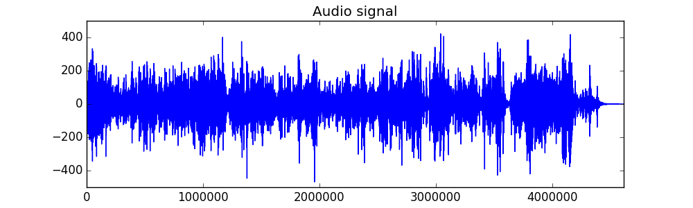
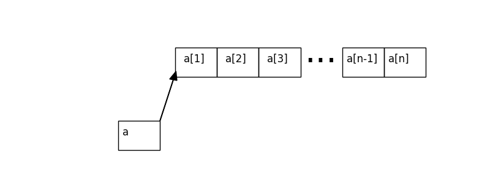
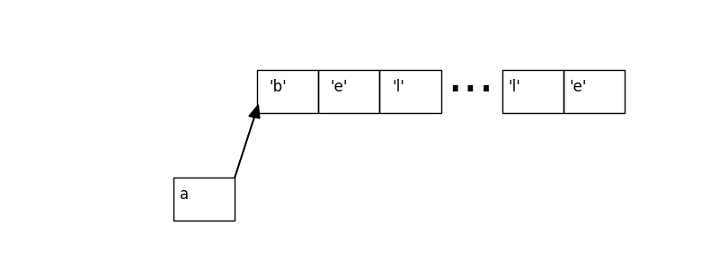

# Introduction aux structures de données et algorithmes


***


## Qu'est-ce qu'on va apprendre dans ce cours?


***


## Aujourd'hui: l'importance de bien représenter ses données

- (LXXXI + IX) / X ?


***


## Aujourd'hui: l'importance de bien représenter ses données

- (LXXXI + IX) / X ?
- (81 + 9) / 10 ?

On va illustrer cette idée en manipulant des séquences, des suites de valeurs.


---


## comment représenter une séquence

 - on a souvent besoin de manipuler une séquence de valeurs.
 - par exemple:
     * l'historique des températures à Paris depuis janvier 2018
     * la liste des arrêts d'une ligne de bus
     * les commandes à préparer dans un fast-food

 - on va numéroter (indicer) les éléments de la séquence: ```a₁, a₂, ..., aₙ```


***


## exemple: une chaine de caractères

 ```"belleville citoyenne"```

```['b', 'e', 'l', 'l', ... , 'n', 'e']```

```a₁='b', a₂='e', a₃='l', ... , a₂₀='e'```


***


## exemple: une ligne de métro

```["Châtelet", "Hôtel de ville", ... , "Mairie des Lilas"]```

```a₁="Châtelet", ... , a₁₃="Mairie des Lilas"```


***


## exemple: un enregistrement audio




```[12.7   4.25  5.19 ... -0.07 -0.   -0.11]```

<!-- a_4616551 = -0.11 -->
```a₁=12.7, a₂=4.25, ... ```


---


## Comment représenter une séquence?

- sur le papier, on a écrit ```a₁, a₂, ..., aₙ```
- en pratique, il faut représenter ces données dans la mémoire d'une machine.
- plusieurs solutions existent, on choisit en fonction des opérations qu'on veut
  pouvoir faire.


---


## Tableaux

- si tous les éléments de ma séquence ont la même taille, je peux les ranger les
  uns à côté des autres dans la mémoire.


***


## Tableaux




***


## Tableaux




***


## Tableaux: random access

- comment savoir la valeur de ```a₇```?


***


## Tableaux: parcours


***


## Tableaux: limitations

- séquence d'objets qui n'ont pas la même taille?
- insertion au milieu d'un tableau?
- les tableaux peuvent être des structures trop rigides si la taille de notre
  séquence change dynamiquement, ou si on doit pouvoir insérer ou supprimer des
  éléments au milieu.


---


## Listes


***


## Listes: parcours


***


## Listes: random access?


***


## Listes: insertion


---


## Conclusion

- on a vu deux exemples de structures de données qui semblent similaires: les listes et les tableaux.
- on voit qu'en pratique, le choix d'une structure de données détermine quelles opérations seront faciles et rapides à réaliser.
- quand vous écrivez un programme, demandez vous:
    * quelles données je vais manipuler?
    * quelles opérations je vais devoir faire dessus?
    * comment représenter mes données pour que mon programme soit facile à écrire?


***


## Conclusion


- comment est-ce que vous choisiriez de représenter:
  * un signal audio?
  * les commandes en cours dans un fast-food?
  * ...
