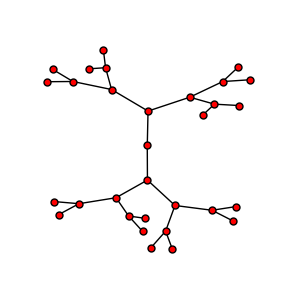
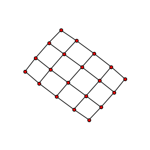
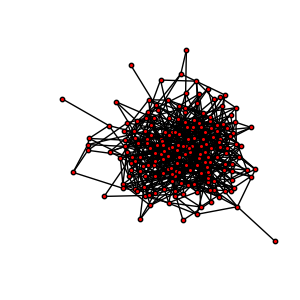

# Graphes

***

## Graphes

- Ce sont des collections de noeuds, connectés par des arêtes.
- les arêtes peuvent être orientées ou non
- https://fr.wikipedia.org/wiki/Graphe_(math%C3%A9matiques_discr%C3%A8tes)

  

***

## Exemples

- plan de métro
- réseaux sociaux
- réseaux de télécom
- circuit électrique
- modèles graphiques probabilistes
- ...
- listes
