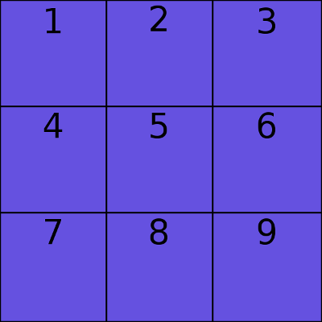
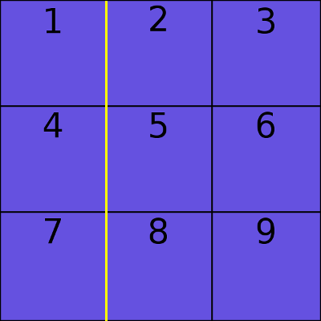
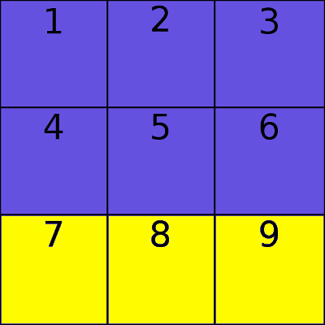
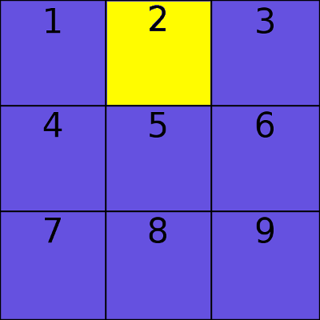
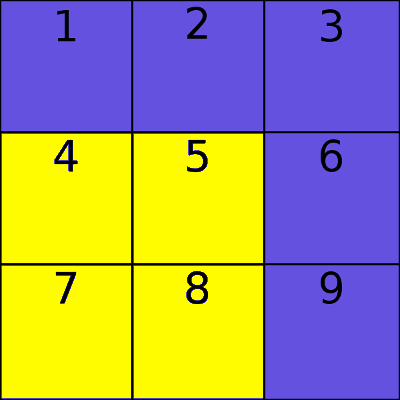
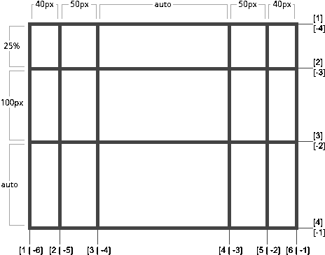
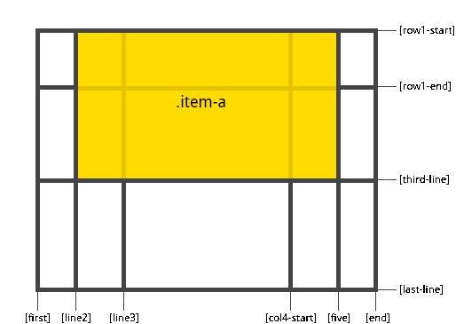

# CSS
## Le positionnement (2)
### Position, Float, Flex, Grid


---


## Le positionnement des éléments


Les éléments HTML se positionnent naturellement de la façon suivante :
- Les éléments `block` se positionnent les uns sous les autres.
- les éléments `inline` et `inline-block` se positionnent les uns à la suite des autres.

Et cela dans l'ordre du document (le _flow_ en anglais).


***


### La propriété `position`

La propriété position permet de modifier le positionnement d'un élement.

Elle peut prendre 4 valeurs :
- `static` (la valeur par défaut)
- `relative`
- `absolute`
- `fixed`


Note: `position : static;`  positionne les éléments comme vu précédemment.


***


### Les propriétés de positionnement

Quand la position n'est pas `static`, on dit que l'élement est **positionné**.

On utilisera alors les propriétés `left`, `top`, `right`, `bottom` pour spécifier la position de l'élement par rapport à un élement de référence.

Cet élement de référence dépend de la valeur de `position` utilisée.


***


---


### Le positionnement relatif

```
position : relative;
```

Un élement positionnés de manière relative est positionné par rapport à sa position initiale dans le _flow_.

Il occupe toujours de l'espace dans la page.

Cela permet notamment de décaler des éléments.


***


```
position : relative;
left : 10px;
```

Cet élement sera affiché 10 pixels vers la **droite**.

Note: expliquer pourquoi left décale vers la droite -> car c'est la gauche de l'élément qu'on décale de 10px;


---


### Le positionnement absolu

```
position : absolute;
```

Un élement positionnés de manière absolue est positionné par rapport à son premier parent **positionné**.

Si aucun élément n'est positionné, il est positionné par rapport au `<body>`.

Il ne prend pas de place dans le _flow_ de la page.

Note: rappeler la déifinition de "positionné".


***


```
position : absolute;
top : 20px;
```

Cet élement sera affiché 20 pixels vers le **bas**.


---


### Le positionnement fixe
```
position : fixed;
```

Un élement positionnés de manière fixe est positionné par rapport à l'affichage.

Il ne prend pas de place dans le _flow_ de la page.

Il défile avec la page.


***


```
position : fixed;
top : 50px;
```

Cet élement sera affiché 50px sous le haut de la page et défilera avec la page.


---


### Z-Index

Quand des éléments sont positionnés, il arrive qu'ils se chevauchent.

On utilise alors la propriété `z-index` pour définir quel élément se place devant ou derrière.

Plus le `z-index` est petit, plus l'élement s'affichera à l'arrière-plan.


---


### Overflow

On utilise la propriété `overflow` pour définir ce qu'il se passe quand un élement dépasse de son parent.

Les valeurs possibles sont :
 - `visible` : le contenu est visible
 - `hidden` : le contenu est caché
 - `scroll` : des barres de défilement sont toujours affichées
 - `auto` : des barres de défilement sont affichées si besoin

On peut utiliser `overflow-x` pour le dépassement horizontal et `overflow-y` pour le défilement vertical.


---


## FlexBox

Flex, FlexBox ou Flexible Box Layout est une manière d'agencer les éléments apparue en CSS3.

Elle permet de manipuler plus simplement les éléments.

FlexBox repose sur 2 concepts :
- le conteneur Flex (Flex Container)
- les éléments Flex (Flex Items)

Flex n'est pas supporté par toutes les versions des navigateurs.


***


### Le support par les navigateurs

Tous les navigateurs ne supportent pas forcément toutes les propriétés, ou certaines sont expérimentales.

[Can I Use ?](http://caniuse.com/)

Pour les propriétés expérimentales, elles sont préfixées par un préfixe vendeur :
- Firefox : `-moz-`
- Chrome : `-webkit-`
- Opéra : `-o-`
- Internet Explorer (lol) : `-ms-`

***


### Le conteneur Flex

`display : flex;`

C'est tout ce qu'il faut pour définir un conteneur Flex !

(On peut aussi utiliser `inline-flex` pour un conteneur _inline_)


***


On va pouvoir définir :
- la direction des éléments (ligne ou colonne) (`flex-direction`)
- l'alignement des éléments (`flex-align`)
- l'espacement des éléments (`justify-content`)
- l'alignement des lignes (`align-content`)


***


### Les éléments Flex

Tout les fils d'un conteneur Flex sont les éléments Flex.

On va pouvoir (re)définir :
- l'ordre des éléments (`order`)
- l'alignement des éléments (`self-align`)
- la taille des éléments (`flex`)


***


Un article sur [FlexBox sur le site CSS Tricks](https://css-tricks.com/snippets/css/a-guide-to-flexbox/)

Les propriétés FlexBox sont aussi sur la [CheatSheet CSS](https://github.com/blank-project/blank-project.github.io/blob/master/cheatsheets/css.md).


---


## Eléments Flottants

Un élément flottant va être retiré du _flow_ et placé à droite ou à gauche de son conteneur.

On écrit `float : left | right;`.

Les éléments suivants vont s'afficher autour de l'élément flottant.

Pour annuler ce comportement on utilise

`clear : left | right | both;`.

Ne pas se servir de cela pour de la mise en page !


---


## Le système de Grid

Le système de **Grid** (grille) permet de disposer les éléments de sa page sous un format de **lignes** et **colonnes** modulables sur 2 dimensions, contrairement à flexbox.

Ce système récemment implémenté dans CSS3 est extrêmement **puissant** et bien plus **simple** à utiliser que les autres système de positionnement.


***


La grid est composée d'un _conteneur_ regroupant des _items_. Il se découpe également en Line, Track, Cell et Area.




***


Il se découpe également en **Line**.




***


Il se découpe également en **Track**.




***


Il se découpe également en **Cell**.




***


Il se découpe également en **Area**.




***


### Structure

```html
<div class="container">
  <div class="item item-1">Votre contenu</div>
  <div class="item item-2">Votre contenu</div>
  <div class="item item-3">Votre contenu</div>
  <div class="item item-4">Votre contenu</div>
  <div class="item item-5">Votre contenu</div>
  <div class="item item-6">Votre contenu</div>
  <div class="item item-7">Votre contenu</div>
  <div class="item item-8">Votre contenu</div>
  <div class="item item-9">Votre contenu</div>
</div>
```

```css
.container {
	display:grid;
}
```


***


### Le conteneur

Comme vu précédemment, le conteneur se déclare en appliquant la propriété `display:grid;` à un conteneur parent direct d'items.

C'est sur cet élément HTML que nous définirons la forme globale de la Grid, en utilisant principalement les propriétés **grid-template-columns** et **grid-template-rows**, pour **colonnes** et **lignes**.


***


### Grid-template


```css
.container {
  grid-template-columns: 40px 50px auto 50px 40px;
  grid-template-rows: 25% 100px auto;
}
```



***


Chaque ligne se voit attribuer automatiquement un numéro positif et négatif permettant l'identification.

Il est possible d'utilisé les unités habituelles (%, px, em...) ainsi que **fr** qui représente une fraction de l'espace disponible.

Ainsi : `grid-template-columns: 1fr 1fr 1fr;` créera 3 colonnes de la même dimension.


***


### Quelques propriétés utiles

**grid-gap** : créer des gouttières entre les cellules.

**justify-items** : gérer l'alignement **horizontal** des items dans leurs cellules.

**align-items** : gérer l'alignement **vertical** des items dans leurs cellules.


***


### Les items composants la grille

Une fois la grille et son contenu défini nous allons pouvoir passer à son contenu.

L'enjeu ici est de positionner les items dans la grille correspondante en se référant aux **"lines"**.

Nous allons utiliser les propriétés **grid-column-start**, **grid-column-end**, **grid-row-start** et **grid-row-end**.


***

Les lignes de votre grille sont automatiquement numérotés vous pouvez ainsi écrire :

```css
.item-a {
  grid-column-start: 2;
  grid-column-end: 5;
  grid-row-start: 1;
  grid-row-end: 3;
}
```



***


et y inclure les éléments que vous souhaitez dans les éléments enfants !


***


### Ça n'est pas tout !

En effet nous n'avons que survolé le système de grid !

Je vous conseille de vous documenter, et plus particulièrement ici :

https://css-tricks.com/snippets/css/complete-guide-grid/

(je leur ai emprunté des schémas!)

ou bien ici :

https://www.w3schools.com/css/css_grid.asp
