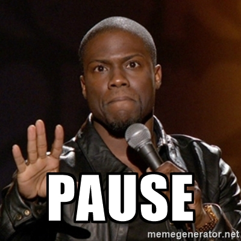

# Responsive Design : les Media Query


---


## Qu'est-ce qu'une Media Query ?

C'est une fonctionnalité CSS3 qui permet d'adapter le style en fonction de certaines caractéristiques (comme la résolution de l'écran par exemple).

Elle est appliquée sur un *media type* spécifique, par défaut ce dernier est `all`.

Elle permette de mettre en pratique le *Responsive Design*.


---


## Mais attends, c'est quoi le Responsive Design ?

C'est créer un design pour qu'il soit adapté à la fois aux écrans d'ordinateurs, aux écrans mobiles, aux tablettes, aux larges résolutions, etc.

C'est quelque chose de fastidieux mais qui aujourd'hui est obligatoire.


***


## Mobile-First

C'est un principe qui stipule que le design d'un site web doit d'abord être réalisé pour les Appareils Mobile.

Il est ensuite adapté pour un affichage sur d'autres Appareils, notamment les ordinateurs.

Cela permet de s'assurer que le site aura toujours un rendu agréable sur mobile.

C'est important car une part toujours plus grande du trafic Internet s'effectue depuis des Mobiles.


---


## Ready to start ?


---


## Comment fait-on une Media Query ?

Tout commence avec la définition de la query par le texte : `@media`.

Et ça ressemble à ça :

```css
@media (max-width: 600px) {
  .facet_sidebar {
    display: none;
  }
}
```


***


## Mais qu'est-ce qu'on met dans notre Query ?

Des expressions qui nous permette de cibler un media.


---


## Les Expressions Media


***


## Media-type

C'est l'expression la plus importante, avant d'écrire une Media Query en entier, il faut savoir à quel type de media celle-ci va servir.

Voici les valeurs possibles :


***


## Media-type

* all : Utilisé par défaut. C'est pour tout type de media
* print : Utilisé pour les imprimantes
* screen : Utilisé pour les écrans
* ...


***


## Les expressions

 Elles sont en fait des tests logiques et leurs resultats sont vrai ou faux.

 Elles sont reliées entre elles par des opérateurs logiques `and`, `,` (qui signifie `ou`), `not`, et `only`.


***


## Quelques précisions

Certaines expressions peuvent être précédées de min/max spécifiant donc la valeur minimale ou la valeur maximale nécessaire.

Elles doivent obligatoirement être en parenthèse.


***


## height

Définit la hauteur voulue.

|Valeur|Media|Accepte min/max|
|-|-|-|-|
|longueur|all|oui|

Pour la longueur se référer aux unités CSS vues, ou [ici](https://developer.mozilla.org/en-US/docs/Web/CSS/length)

```css
@media (min-height: 500px) {
    //style here
}
```

Note: S'utilise généralement avec min ou max


***


## width

Définit la largeur voulue.

|Valeur|Media|Accepte min/max|
|-|-|-|-|
|longueur|all|oui|

Pour la largeur se référer aux unités CSS vues, ou [ici](https://developer.mozilla.org/en-US/docs/Web/CSS/length)

```css
@media (min-width: 200px) {
    //style here
}
```

Note: S'utilise généralement avec min ou max


***


## orientation

Détermine si l'écran est plus haut que large ou inversement.

|Valeur|Media|Accepte min/max|
|-|-|-|-|
|landscape ou portrait|media/visual|non|

```css
@media (orientation: portrait) {
    //style here
}
```


***


## resolution

Indique la résolution (densité de pixel) de l'appareil

|Valeur|Media|Accepte min/max|
|-|-|-|-|
|dpi,dpcm ou dppx|media/visual|oui|

```css
@media screen and (min-resolution: 2dppx) {
    //style here
}
```

Note: Dots per inches, dots per centimeters, dots per pixels


***


## PAUSE !



***


## Les opérateurs logiques


***


## and
`and` signifie `et` en anglais et permet de vérifier si telle expression ET l'expression suivante sont vraies. Si c'est le cas, alors la media query s'applique.


***


## ,
Comme en CSS classique, la virgule signifie que si telle expression ou celle qui suit est vraie alors la media query s'applique.


***


## not
Ce mot clé nous permet de signifier que si l'expression n'est pas vérifié alors on applique la media query.


***


## only
Cela évite que les anciens browsers qui ne sont pas à jour de charger le contenu de la media query.


---


## Mais où est-ce qu'on définit le style ?
Parce que c'est un peu flou tout ça !

A l'intérieur !

```css
@media (max-width: 600px) {
  .facet_sidebar {
    display: none;
  }
}
```


***


## Ah oui et dernière chose !
On peut lier une feuille de style en ayant une condition media :

```html
<link rel="stylesheet" media="all and (min-width: 500px)" href="mediasheet.css" />
```


---


## Media query c'est fini


