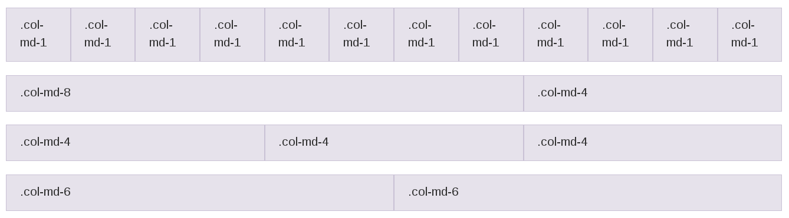
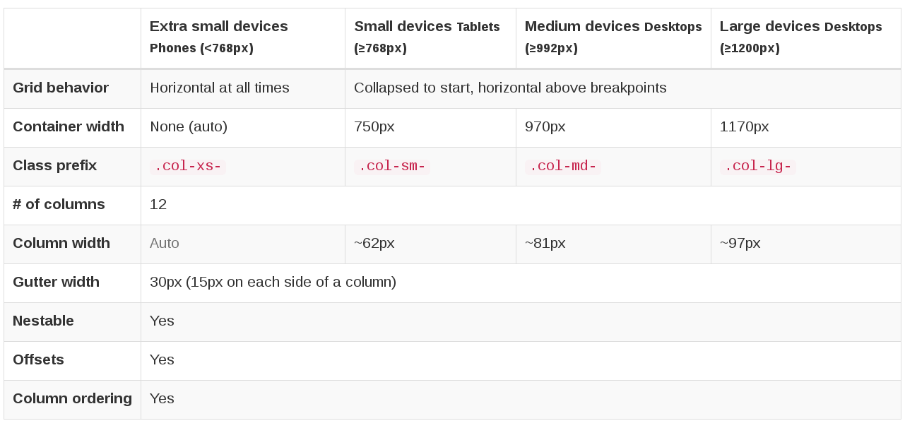

 ## Bootstrap

---

## Qu'est-ce que bootstrap ?
C'est un framework CSS qui nous simplifie la vie ! Il nous permet de développer un site internet plus facilement que de faire tout "from scratch". Le toute en appliquant simplement des classes ou des id sur les éléments.

***

## Mais c'est quoi un framework ?
C'est un code source qui nous donne une structure et nous force à utiliser certains éléments html tout en nous donnant des pratiques facilitant le développement.

***

## Library vs Framework ?
Une "library" ou bibliothèque en français à contrario nous fournit des éléments et nous laisse appeler les composants nécessaires. Par defaut par exemple `bootstrap` est un framework parce qu'il ne nous demande pas tout le temps d'appeler ses composants et apporte des actions par défaut.

***

## Bootstrap ça vient d'où ?
De `twitter` ! Au début ça s'appelait `Twitter Blueprint`. Il a été développé par quelqu'un qui voulait simplifier la vie des développeur au sein de la société. C'était juste un outil interne mais ensuite... ça a été ouvert au public ! Et là miracle.

***

## Est-ce qu'il existe d'autres framework de ce genre ?
Oui ! Et les plus connus sont : [Foundation](http://foundation.zurb.com/), [Materialise](http://materializecss.com/) et [PureCSS](http://purecss.io/). Il en existe plein d'autres selon les besoins que vous avez. À vous de regarder, en voici quelque listes :
* [liste 1](http://blog.webkid.io/css-frameworks-bootstrap-alternatives/)
* [liste 2](http://www.hongkiat.com/blog/bootstrap-alternatives/)

---

## En gros ça vous permet de :

Faire ce que vous avez fait mais plus rapidement et plus facilement. Mais ça peut parraitre magique, c'est pourquoi on a d'abord étudié le CSS sans framework.

---

## Ce que bootstrap change par défaut
* Les titres (h1 > h6)
* La taille de police et la police par défaut
* Le fonctionnement des balises de typographie (em, mark, u, small, etc.)
* Blockquotes, address, listes,...

Ce qui concerne les textes basiques : [voir ici](http://getbootstrap.com/css/#type)

---

## Le système de grille
C'est ce qui a fait la renomée de bootstrap et c'est le framework qui a popularisé cette solution au positionnement des éléments.

***

## Qu'est-ce qu'une grille ?

Note: Chaque ligne ici contient au total 12 unités. 12 unités de 1 en première ligne, 1 unité de 8 et une unité de 4 en 2e ligne, 3 unités de 4 en 3e ligne, et 2 unités de 6 en dernière ligne.
Elles font toutes parties de la même grid.

***

## Est-ce que tu peux nous en dire un peu plus ?

Chaque élément est une `
` qui possède une classe. Cette classe est constituée comme suit : col-*{{size}}*-*{{unit}}*. Chaque ligne est définie par une div avec la class `.row`.

Note: exo, sortir le HTML de la 2e ligne.

***

## Size

C'est un prefix qui définit comment se comporte la colone pour tel ou tel type de device.

***

## Unit

Souvenez-vous la somme des unités d'une ligne ne doit pas faire plus de 12. Sinon ça déborde sur la ligne d'en dessous.

Une ligne avec 24 correspondra donc à deux lignes avec des éléments à 12.

Ça nous permet de gérer le responsive de manière plutôt simple. Quoi que maintenant on a `flex` !

---

## Et on a quoi à part la grille et le texte ?
* nav-bar pré-faite
* dropdowns
* images
* des parties uniquement visibles sur certains devices
* boutons

etc.

---

## Faisons un tour sur la doc !
Passons en revue le css, les composants et regardons la doc
Le site : [https://getbootstrap.com/](https://getbootstrap.com/)
