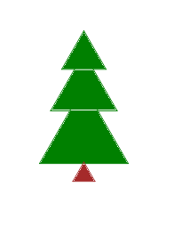
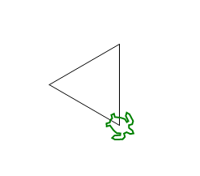
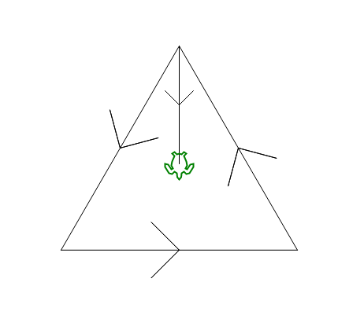
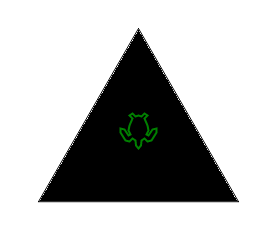
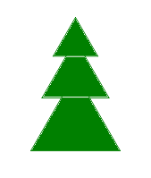
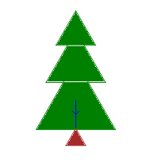
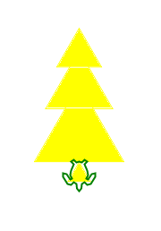
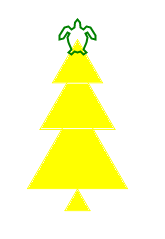
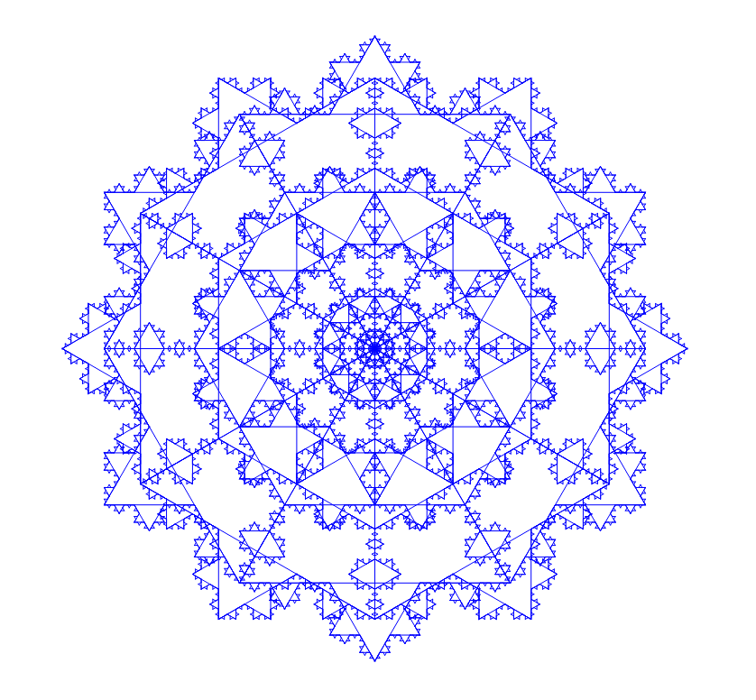
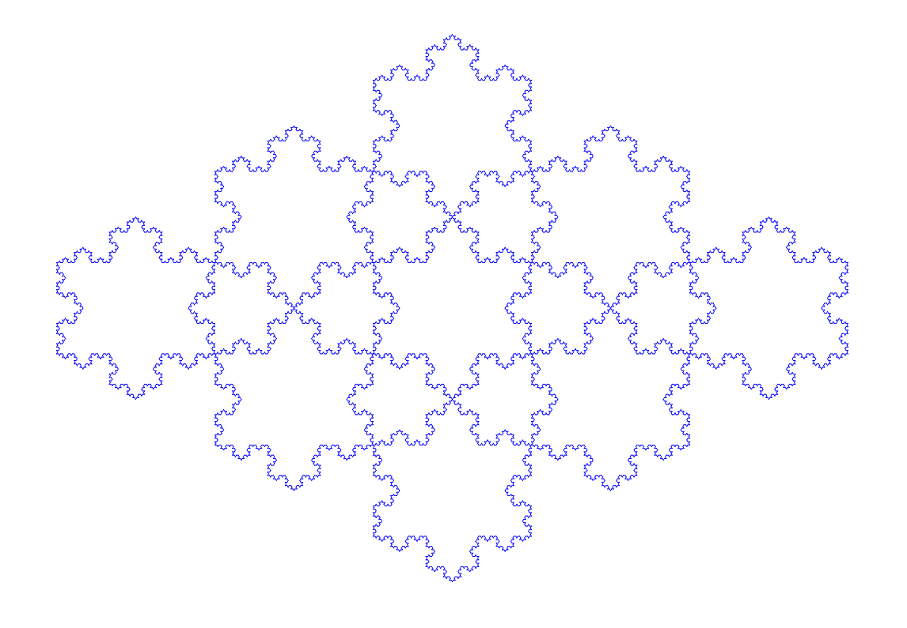

# Introduction à la programmation part. 2


***


- Pseudo-code
- Logo sur https://inexorabletash.github.io/jslogo/
- Faire bouger la tortue
- Expressions
- Tests


---


## Pseudo - Code


***


## Variables
- `LIRE varname`
- `ECRIRE varname`
- `varname <- valeur`


***


## Opérateurs de condition
- `PLUS GRAND QUE`
- `PLUS PETIT QUE`
- `ÉGAL À`
- `NON`
- `OU`
- `ET`


***


## BOUCLES
- `POUR ... ALLANT DE ... À ... AU PAS DE ...`
- `TANT QUE ...`
- `RÉPÉTER ... JUSQU'À`


***


## Début et Fin
- `DÉBUT`
- `FIN`


***


## Création d'une fonction
```
Nom de la fonction : nomDeLaFonction
Description : Décrire votre fonction ici
En-tête : nomDeLaFonction(nombre1, nombre2)
Variables locales :
  somme (entier)
Instructions :
  somme <- nombre1 + nombre2
  RETOURNER somme
FIN
```


***


Consigne : pour tous les exercices suivants essayez d'érire sous forme de logigramme ou pseudo code avant de coder quelque chose.


---


# Rappels


***


## Rappels

- https://inexorabletash.github.io/jslogo/
- que fait le programme suivant?
```
forward 100
print "Bonjour!
print 2 + 2
```


***


## Rappels: déplacer la tortue


- effacer l'écran et faire dessiner un carré à la tortue.
- commandes utiles:
  - `forward 100`: avancer de 100 pas

  - `back 100`: reculer de 100 pas

  - `right 90`: tourner à droite de 90°

  - `left 90`: tourner à gauche de 90°

  - `clearscreen`: efface l'écran et ramène la tortue au centre

- cliquer sur "Run" ou CTRL+Enter pour éxécuter


***


## Rappels: déplacer la tortue


- effacer l'écran et faire dessiner un carré à la tortue.

```
clearscreen
forward 100
left 90
forward 100
left 90
forward 100
left 90
forward 100
left 90
```


***


## Rappels: expressions

- une combinaison de valeurs et d'opérateurs qui produit une valeur
```
2
2 + 0.5
```
- on peut utiliser des parenthèses pour grouper les expressions:
```
(3 + 1) / 2
```

- opérateurs utiles:
  - `+`, `-`: addition, soustraction
  - `*`, `/`: multiplication, division
  - et beaucoup d'autres


Note: in logo for some reason whitespace around parentheses is sometimes important


***


## Des valeurs particulières: `true` et `false`

- "vrai" et "faux" en Français
- "vrai" <=> 1 et "faux" <=> 0
- appelés Booleans (https://fr.wikipedia.org/wiki/Alg%C3%A8bre_de_Boole_(logique))
- le résultat de certaines expressions peut être "vrai" ou "faux":
```
true
false
1
0
0 = 1
2 + 2 = 4
1 > 2
"hello = "bonjour
```


***


## `true` et `false`

- opérateurs
  - `=`, `<>` : égal, différent

  - `>`, `<`: strictement supérieur, strictement inférieur

  - `>=`, `<=`: supérieur ou égal, inférieur ou égal

  - `not`, `and`, `or`: négation, et, ou
    - par exemple: `and (1 > 0) (2 > 1)`

- un nombre différent de 0 est "vrai"


***


## Rappels: tests


```
ifelse [quelque_chose_qui_peut_etre_vrai_ou_faux]
  [ce_qu_on_fait_si_c_est_vrai]
  [ce_qu_on_fait_si_c_est_faux]
```

- Par exemple:

```
ifelse[true]
  [print "oui]
  [print "non]

ifelse[0 > 1]
  [print "oui]
  [print "non]
```


***


## User input

- `ifelse` sert à rien si on connaît déjà la réponse!
- `(readword "name?)`: afficher "name?" et retourner la réponse de l'utilisateur:
```
print (readword "name?)
```


***


## Tests: exercice

- demander à l'utilisateur si il parle français
  - Écrire l'algorithme sous forme de pseudo code ou logigramme
  - si la réponse est "oui", imprimer "bonjour"
  - sinon, imprimer "hello"


***


## Tests: exercice

- demander à l'utilisateur si il parle français
  - si la réponse est "oui", imprimer "bonjour"
  - sinon, imprimer "hello"

```
ifelse[(readword "français?) = "oui]
[print "bonjour]
[print "hello]
```


***


## Tests imbriqués

- demander à l'utilisateur si il parle français
  - si la réponse est "oui", imprimer "bonjour"
  - sinon, lui demander si il parle espagnol
    - si la réponse est oui, imprimer "Hola"
    - si la réponse est non, imprimer "hello"

```
ifelse[(readword "français?) = "oui]
  [print "bonjour]
  [
  ifelse[(readword "espagnol?) = "oui]
    [print "hola]
    [print "hello]
  ]
```


***


## Tests

- `ifelse` sert à rien si on connaît déjà la réponse!
- `random 3`: choisir un nombre au hasard entre 0 et 3: 0, 1 ou 2

```
ifelse[random 2]
  [print "oui]
  [print "non]
```

***

## Tests: exercice (marche aléatoire)

- choisir 0 ou 1 au hasard
  - si 0, orienter la tortue vers -45°
  - si 1, orienter la tortue vers +45°
- avancer de 5 pas

- utiliser `setheading 45` pour orienter la tortue vers +45°


***

## Tests: exercice (marche aléatoire)

- choisir 0 ou 1 au hasard
  - si 0, orienter la tortue vers -45°
  - si 1, orienter la tortue vers +45°
- avancer de 5 pas

```
ifelse[random 2]
  [setheading 45]
  [setheading -45]

forward 5
```


---


# Les boucles et les variables


***


## Les boucles


- permettent de répéter automatiquement une suite d'opérations
- premier genre de boucle en Logo: `repeat`

  ```
  repeat nombre_de_fois [
    ce_qu_il_faut_faire
  ]
  ```

- imprimer 5 fois "hello":

  ```
  repeat 5 [
    print "hello
  ]
  ```

- un passage dans la boucle s'appelle une "itération"


***


## Les boucles: repeat


- Utiliser `repeat` pour répéter l'exercice précédent (marche aléatoire) 50 fois
- Il suffit de mettre le code que vous avez déjà à l'intérieur d'une boucle


***


## Les boucles: repeat


- Utiliser `repeat` pour répéter l'exercice précédent (marche aléatoire) 50 fois
- Il suffit de mettre le code que vous avez déjà à l'intérieur d'une boucle

```
repeat 50[

  ifelse[random 2]
    [setheading 45]
    [setheading -45]

  forward 5
]
```


***

## Boucles imbriquées

- On peut imbriquer les boucles:

```
repeat 50[
  repeat 50[
    ifelse[random 2]
      [setheading 45]
      [setheading -45]
    forward 5
  ]
  penup
  home
  pendown
]

```


***


## Les boucles: repeat

- Utiliser repeat pour dessiner un carré
- Rappel: on avait dessiné un carré avec:

```
forward 100
left 90
forward 100
left 90
forward 100
left 90
forward 100
left 90
```


***


## Les boucles: repeat

- Utiliser repeat pour dessiner un carré

  ```
  repeat 4 [
  forward 100
  left 90
  ]
  ```

- Et pour dessiner un triangle:

  ```
  repeat 3[
    forward 100
    left 120
  ]
  ```

- Et pour dessiner un polygone à 13 côtés:

  ```
  repeat 13[
    forward 100
    left 360 / 13
  ]
  ```


***


## Les variables

- On peut donner un nom à un morceau de la mémoire de l'ordinateur
- (En Logo,) il faut aussi lui donner une valeur
- En logo, on utilise le mot-clé `make`:

  `make "nom_de_la_variable valeur`

```
make "city "Paris
make "population 2240000
```


note: https://goo.gl/gq6Q6a
 http://www.pythontutor.com/visualize.html#code=var%20city%20%3D%20%22Paris%22%0Avar%20population%20%3D%202240000&cumulative=false&curInstr=2&heapPrimitives=false&mode=display&origin=opt-frontend.js&py=js&rawInputLstJSON=%5B%5D&textReferences=false


***


- Ça permet de retenir le résultat d'une expression, de faire communiquer les
  différentes parties d'un programme, de manipuler plus facilement les valeurs
  avec lesquelles on travaille.


***


## Les variables

- On peut accéder au contenu d'une variable avec `:`, et l'utiliser dans une
  expression:

```
make "city "Paris
print :city

make "price 13.5
print (120 / 100) * :price

make "step 100
forward :step
right 90
forward 2 * :step

make "side 30
make "surface (:side * :side)
print :surface
```


***


## Les variables: exercice

- Créez une variable qui va contenir la longueur du côté d'un triangle
  (choisissez le nom); donnez-lui une valeur entre 50 et 200
- Dessiner un triangle en utilisant cette variable
- Dessiner un triangle deux fois plus gros avec le même code, en changeant juste
  la valeur de la variable


***


## Les variables: exercice

- Créez une variable qui va contenir la longueur du côté d'un triangle
  , dessiner un triangle en utilisant cette variable

```
make "side 150
```

```
repeat 3 [
  forward :side
  left 120
]
```
- Dessiner un triangle deux fois plus gros avec le même code

```
make "side (2 * :side)
repeat 3 [
  forward :side
  left 120
]
```


***


## Les variables: exercice

- On peut utiliser une variable comme argument de la boucle `repeat`
- Créer une variable `n_sides` et dessinez un polygone avec `n_sides` côtés
- Indice: à chaque itération il faut tourner de `360 / n_sides` et avancer

```
make "n_sides 6
make :side 100
repeat :n_sides [
forward :side
left 360 / :n_sides
]
```

***


## Plus de boucles: `for`

- Semblable à `repeat`, mais donne accès au numéro de l'itération (passage dans
  la boucle)
- on y accède avec une variable:

  ```
  for[nom_de_l_iterateur debut fin][
    ce_qu_il_faut_faire
  ]
  ```

- pour `i` allant de 0 à 15, imprimer `i`

  ```
  for [i 0 15][
    print :i
  ]
  ```

Note: https://goo.gl/V9U75X

<!-- Note: http://www.pythontutor.com/visualize.html#code=console.log%28%22start%22%29%3B%0A%0Afor%20%28var%20i%20%3D%200%3B%20i%20!%3D%3D%204%3B%20i%2B%2B%29%7B%0A%20%20%20%20console.log%28%22i%3A%20%25d%22,%20i%29%3B%0A%7D%0A%0Aconsole.log%28%22finished!%22%29%3B&cumulative=false&curInstr=0&heapPrimitives=false&mode=display&origin=opt-frontend.js&py=js&rawInputLstJSON=%5B%5D&textReferences=false -->


***


## boucle `for`: exercice

- Dessiner une spirale:
- pour `i` allant de 0 à 200,
  - avancer de `i / 10`
  - tourner de 6°
  - imprimer `i`


***


## boucle `for`: exercice


- Dessiner une spirale:

- pour `i` allant de 0 à 200,

  - avancer de  `i / 10`
  - tourner de 6°
  - imprimer `i`

    ```
    for [i 0 200][
      forward :i / 10
      right 6
      print :i
    ]
    ```

- répéter l'opération ci-dessus 20 fois avec une boucle (`for` ou `repeat`) pour
  faire un beau dessin


***


## Plus de boucles: `while`

- une boucle qui se répète tant qu'une condition est vraie (`true`)

- `while` = "tant que" en anglais

- imprimer les nombres de 0 à 15, cette fois en utilisant une boucle `while`:

  ```
  make "i 0
  while[:i < 15][
    print :i
    make "i :i + 1
  ]
  ```


***


## Boucle `while`

- attention: si la condition ne devient jamais fausse, que se passe-t-il?

```
fence
while[true][
  forward 20
  right random 360
]
```

***


## Boucle `while`: exercice


- donner un calcul à faire à l'utilisateur
- tant qu'il n'a pas la bonne réponse, lui dire de recommencer


```
make "success false

while[ not :success ][

  make "a random 10
  make "b random 10
  make "answer ( readword ( sentence :a "+ :b "? ) )

  ifelse[:answer = (:a + :b)]
  [make "success true]
  [print "non!]

]

print "bravo!
```


---


# Les fonctions


***


## Les fonctions

- On peut regrouper une séquence d'actions (statements) et leur donner un nom

  ```
  TO say_hello
    print "hello
  END

  TO draw_square
   repeat 4 [
      forward 100
      left 90
    ]
  END
  ```

- syntaxe en Logo:
  ```
  TO nom_de_la_fonction
    ce_qu_il_faut_faire
  END
  ```


***


## Appel de fonction


- Pour éxécuter le code d'une fonction, il faut l'"appeler"
- On appelle une fonction en tapant son nom: `draw_square`
- Vous avez déjà appelé beaucoup de fonctions: par exemple `clearscreen`

***

## Les fonctions: exercice

- La fonction `clearscreen` fait deux choses:
  - ramener la tortue au centre (comme le fait `home`)
  - effacer l'écran (comme le fait `clean`)

- écrivez votre fonction `my_clearscreen` qui fait la même chose que `clearscreen`
- appelez-la pour vérifier que ça marche!


***

## my_clearscreen


```
TO my_clearscreen
  home
  clean
END

forward 100
wait 120
my_clearscreen
```

***


## Les fonctions: exercice

- écrivez une fonction `draw_triangle` qui dessine un triangle
- dessinez un triangle

***


## Les fonctions: exercice

- écrivez une fonction `draw_triangle` qui dessine un triangle
- dessinez un triangle

```
TO draw_triangle
  repeat 3[
    forward 100
    left 120
  ]
END

draw_triangle
```

***

## Arguments

- Les fonctions peuvent accepter des "arguments", ou "paramètres"
- Ça permet de changer le comportement de la fonction au moment de l'éxécuter

```
TO print_double :number
  print :number * 2
END

TO print_product :number_a :number_b
  print :number_a * :number_b
END

print_double 3
print_product 4 5
```

- À l'intérieur de la fonction, les arguments sont des variables qu'on peut utiliser

***

## Arguments: syntaxe


```
TO nom_de_la_fonction :nom_de_arg_1 :nom_de_arg_2 ...
  ce_qu_il_faut_faire
END
```

exemple:

```
TO print_double :number
  print :number * 2
END

print_double 7
```

- Écrivez une fonction qui accepte un nombre a et imprime le résultat de a + 1
- Écrivez une fonction qui accepte deux nombres a et b et imprime le résultat de
  a + b
- Écrivez une fonction max qui accepte deux nombres a et b et imprime le plus grand


***


## print_increment


- Écrivez une fonction qui accepte un nombre a et imprime le résultat de a + 1

  ```
  TO print_increment :a
    print :a + 1
  END

  print_increment 2
  print_increment 17
  ```


***


## print_sum


- Écrivez une fonction qui accepte deux nombres a et b et imprime le résultat de
  a + b

  ```
  TO print_sum :a :b
    print :a + :b
  END

  print_sum 2 3
  print_sum 5 1
  print_sum -10 12
  ```


***


## print_max


- Écrivez une fonction max qui accepte deux nombres a et b et imprime le plus grand

  ```
  TO print_max :a :b
  ifelse[:a >= :b]
    [print :a]
    [print :b]
  END

  print_max 2 5
  print_max 7 3
  ```

***


## Triangle sur mesure

- Écrivez une fonction qui accepte un nombre `side_length` et dessine un triangle
  dont la longueur des côtés est side_length

- Rappel: pour dessiner un triangle de côté 100,

```
TO draw_triangle
  repeat 3[
    forward 100
    left 120
  ]
END
```

***


## Triangle sur mesure

- Écrivez une fonction qui accepte un nombre `side_length` et dessine un triangle
  dont la longueur des côtés est side_length

```
TO draw_triangle :side_length
  repeat 3[
    forward :side_length
    left 120
  ]
END

draw_triangle 100
draw_triangle 200
draw_triangle 300
```

***


## Return values

- Les fonctions peuvent retourner un résultat
- Les fonctions qu'on a écrites font quelque chose mais ne retournent rien
- exemples:
  - `home`, `clearscreen`, `print` ne retournent rien
  - `xcor` retourne la première coordonnée de la position de la tortue
  - `readword` retourne ce que l'utilisateur a tapé


***


## Return values

- Les fonctions peuvent retourner un résultat
- Pour donner un résultat, on utilise `output`

```
TO add :a :b
  output :a + :b
END

print add 3 5
make "sum add 3 5
print :sum
```

```
TO min :a :b
 ifelse[:a <= :b]
   [output :a]
   [output :b]
END

print min 3 7
make "smallest min 3 7
print :smallest
forward :smallest * 50
```


***

## Return values: exercice

- Écrivez une fonction `max` qui accepte deux nombres a et b et retourne le plus grand
- Écrivez une fonction `rectif` qui accepte un nombre a et retourne a si a > 0, 0 sinon
- Écrivez une fonction qui accepte la largeur et la hauter d'un rectangle et
  retourne sa surface (indice: surface = largeur * longueur)


***


## max


- Écrivez une fonction max qui accepte deux nombres a et b et retourne le plus grand

```
TO max :a :b
  ifelse[:a >= :b]
    [output :a]
    [output :b]
END

make "biggest max 3 9
print :biggest
```


Note: https://goo.gl/Kajeis

<!-- Note: http://www.pythontutor.com/visualize.html#code=console.log%28%22start%22%29%3B%0A%0Afunction%20max%28a,%20b%29%7B%0A%20%20if%28a%20%3E%3D%20b%29%7B%0A%20%20%20%20return%20a%3B%20%20%0A%20%20%7D%20%20%0A%20%20return%20b%3B%0A%7D%0A%0Avar%20result_1%20%3D%20max%285,%209%29%3B%0Aconsole.log%28%22result%3A%20%25d%22,%20result_1%29%3B%0A%0Avar%20result_2%20%3D%20max%2815,%209%29%3B%0Aconsole.log%28%22result%3A%20%25d%22,%20result_2%29%3B%0A%0Aconsole.log%28%22finished!%22%29%3B&cumulative=false&curInstr=0&heapPrimitives=false&mode=display&origin=opt-frontend.js&py=js&rawInputLstJSON=%5B%5D&textReferences=false -->


***

## rectif


- Écrivez une fonction rectif qui accepte un nombre a et retourne a si a > 0, 0 sinon
- OK:
  ```
  TO rectif :a
  ifelse[:a >= 0]
    [output :a]
    [output 0]
  END
  ```

- mieux: réutilisez ce que vous avez déjà fait!

  ```
  TO rectif :a
    output max :a 0
  END

  print rectif 3
  print rectif -3
  ```

***


## surface


- Écrivez une fonction qui accepte la largeur et la hauter d'un rectangle et
  retourne sa surface (indice: surface = largeur * longueur)

```
TO surface :height :width
  output :height * :width
END

print surface 5 4
print surface 5 5
```


---


# Exercice plus long: dessiner des sapins


***


## Sapins


- On va utiliser ce qu'on a vu jusqu'à maintenant pour écrire un programme plus
  compliqué
- En combinant les outils de bases qu'on vient de voir, on peut faire beaucoup
  de choses!


***


## Sapins


- On dessine un sapin en empilant 4 triangles




***

## Sapins: organisation

- Il nous faut:
  - Une fonction qui dessine un triangle (on l'a déjà écrite)
  - Une fonction qui dessine un des triangles verts et laisse la tortue en bonne
    position pour le triangle suivant
  - Une fonction qui dessine les trois triangles verts et ajoute le pied du sapin


***

## Sapins: `draw_triangle`

- Écrire une fonction qui dessine un triangle
- On doit pouvoir choisir la taille du triangle

```
TO draw_triangle :side_length
; ...
END
```



***

## Sapins: `draw_triangle`

- Écrire une fonction qui dessine un triangle
- On doit pouvoir choisir la taille du triangle

```
TO draw_triangle :side_length
  repeat 3[
    forward :side_length
    left 120
  ]
END
```

***


## Sapins: `draw_tree_level`


- Écrire une fonction qui dessine un étage du sapin
- Commencer par orienter la tortue dans la bonne direction pour que le
  triangle pointe vers le haut




***


## Sapins: `draw_tree_level`


- Avec quel angle doit-on commencer? Utilisez `set_heading` pour orienter la tortue


***


## Sapins: `draw_tree_level`


```
TO draw_tree_level :side_length
  setheading -150
  draw_triangle :side_length
  setheading 180
  forward :side_length / 2
END
```


***


## Sapins: `draw_tree_level`


- Modifiez la fonction `draw_tree_level` pour que le trait vertical n'apparaîsse
  pas: on ne veut que les côtés du triangle.
- indice: utilisez `penup` pour lever le crayon et `pendown` pour le reposer


***


## Sapins: `draw_tree_level`


- Modifiez la fonction `draw_tree_level` pour que le trait vertical n'apparaîsse
  pas: on ne veut que les côtés du triangle.

```
TO draw_tree_level :side_length
  setheading -150
  draw_triangle :side_length
  setheading 180
  penup
  forward :side_length / 2
  pendown
END
```


***


## Sapins: `draw_tree_level`

- Modifiez la fonction `draw_tree_level` pour peindre le triangle (le remplir)
- indice: une fois que la tortue est au milieu du triangle, utiliser `fill`





***


## Sapins: `draw_tree_level`

- Modifiez la fonction `draw_tree_level` pour peindre le triangle (le remplir)


```
TO draw_tree_level :side_length
  setheading -150
  draw_triangle :side_length
  setheading 180
  penup
  forward :side_length / 2
  pendown
  fill
END
```


***


## Sapins: `draw_tree`


- Maintenant qu'on a `draw_tree_level`, il suffit de l'appeler trois fois pour
  dessiner les branches du sapin!
- Écrivez la fonction `draw_tree` qui dessine trois triangles empilés
- Choisissez des tailles adaptées pour les triangles: de plus en plus grands
  (par exemple 50, 75, 100)


***


## Sapins: `draw_tree`


- Maintenant qu'on a `draw_tree_level`, il suffit de l'appeler trois fois pour
  dessiner les branches du sapin!
- Écrivez la fonction `draw_tree` qui dessine trois triangles empilés
- Choisissez des tailles adaptées pour les triangles: de plus en plus grands
  (par exemple 50, 75, 100)

```
TO draw_tree
  draw_tree_level 50
  draw_tree_level 75
  draw_tree_level 100
END
```

***


## Sapins: `draw_tree`


- Un sapin, c'est vert! modifiez la fonction `draw_tree` pour dessiner un sapin vert
- vous pouvez utiliser `setpencolor` pour changer la couleur du crayon




***


## Sapins: `draw_tree`


- modifiez la fonction `draw_tree` pour dessiner un sapin vert

```
TO draw_tree
  setpencolor "green
  draw_tree_level 50
  draw_tree_level 75
  draw_tree_level 100
END
```


***


## Sapins: `draw_tree`


- Il ne manque plus que le pied du sapin
- Il faut faire descendre la tortue encore un peu, pour ne pas dessiner le pied
  au milieu du dernier triangle vert
- Il faut aussi changer la couleur en marron
- Ensuite, on peut à nouveau utiliser `draw_tree_level`





***


## Sapins: `draw_tree`

- De combien on doit descendre?
  - vous pouvez essayer plusieurs valeurs jusqu'à trouver la bonne (à peu près)
  - vous pouvez la calculer: si le côté de votre dernier triangle est l, sa
    hauteur est

    h = l * sin(60°)

    On est déjà descendu de l / 2, donc il faut rajouter

    l * (sin(60°) - 0.5) = l * 0.37

    **si votre triangle a un côté de 100, avancez de 37 pas**


***


## Sapins: `draw_tree`


- Il ne manque plus que le pied du sapin

```
TO draw_tree
  setpencolor "green
  draw_tree_level 50
  draw_tree_level 75
  draw_tree_level 100
  penup
  setpencolor "brown
  forward 37
  pendown
  draw_tree_level 25
END
```


***

## Sapins

Et voilà!


... est-ce qu'on a fini?


***

## Cleanup


... est-ce qu'on a fini?

- la fonction `draw_tree` dessine un sapin, mais elle fait aussi beaucoup de
  choses qu'on ne lui a pas demandées:
  - elle change la couleur du crayon
  - elle change la position et l'orientation de la tortue





***


## Cleanup

- à la fin de la fonction, nettoyez tout ça en rétablissant les valeurs initiales
- il faut définir des variables au début de la fonction pour retenir les valeurs
  de départ
- utilisez `pos` pour connaître la position, `pencolor` pour la couleur, et
  `heading` pour l'orientation
- utilisez `localmake` plutôt que `make` pour définir des variables locales


***


## Cleanup


```
TO draw_tree

  localmake "start_pos pos
  localmake "start_pendown pendownp
  localmake "start_pencolor pencolor
  localmake "start_heading heading

  setpencolor "green
  pendown

  draw_tree_level 50
  draw_tree_level 75
  draw_tree_level 100
  penup
  setpencolor "brown
  forward 37
  pendown
  draw_tree_level 25

  penup
  setpos :start_pos
  setheading :start_heading
  setpencolor :start_pencolor
  if [:start_pendown][pendown]

END
```


***


## Sapins


Cette fois c'est bon!


essayez de dessiner quelques sapins à plusieurs endroits

(**pour s'exercer**: faites de la couleur et de la taille des arguments de
`draw_tree` pour dessiner des sapins de toutes les couleurs et toutes les
tailles)


***


# Fin du cours


---


# Exercice en plus: forêt


***


## Forêt

- et les boucles dans tout ça?
- un sapin tout seul, c'est triste
- avec une boucle, écrivez une fonction `draw_forest_line` qui dessine plusieurs
  sapins les uns à côté des autres
- avec une autre boucle, écrivez une fonction `draw_forest` qui dessine
  plusieurs lignes de sapins


***


## Forêt


***


## Forêt


```
TO draw_forest_line
  localmake "start_pendown pendownp
  localmake "start_x xcor
  localmake "start_y ycor
  penup
  while [xcor < 500][
    setx xcor + random 50
    sety ycor + random 50
    pendown
    draw_tree
    penup
    setx xcor + 150
    sety :start_y
  ]
  setx :start_x
  sety :start_y
  if [:start_pendown][pendown]
END


TO draw_forest
  localmake "start_pendown pendownp
  localmake "start_x xcor
  localmake "start_y ycor
  penup
  while [ycor > - 300][
    draw_forest_line
    sety ycor - 200
    setx :start_x
  ]
  setx :start_x
  sety :start_y
  if [:start_pendown][pendown]
END

cs penup setxy -500 300 draw_forest
```


***


# Exercice en plus: flocons


***


## TODO: snowflake


https://fr.wikipedia.org/wiki/Flocon_de_Koch


***


## TODO: snowflake


```
TO draw_triangle :side_length
  localmake "vertices []
  queue "vertices pos
  repeat 3 [
    forward :side_length
    queue "vertices pos
    left 120
  ]
  OUTPUT :vertices
END


TO next_snowflake :vertices :step
  localmake "new_vertices []
  setpos first :vertices
  queue "new_vertices pos
  for [next_item 2 (count :vertices)][
    localmake "next_vertex item :next_item :vertices
    setheading towards :next_vertex
    ; alternative to passing step_length (but requires knowing ||.||_2)
    ; localmake "distance sqrt(
    ;   ((first :next_vertex) - xcor)^2 + ((last :next_vertex) - ycor)^2)
    ; localmake "step :distance / 3
    forward :step
    queue "new_vertices pos
    right 60
    forward :step
    queue "new_vertices pos
    left 120
    forward :step
    queue "new_vertices pos
    right 60
    forward :step
    queue "new_vertices pos
  ]
  output :new_vertices
END


TO draw_snowflake :n_iter :side_length :clear :delay
  if[:clear and n_iter > 0][penup]
  right 90
  localmake "vertices draw_triangle :side_length
  localmake "step_length :side_length / 3
  repeat :n_iter [
    if [repcount = :n_iter][pendown]
    localmake "vertices next_snowflake :vertices :step_length
    localmake "step_length :step_length / 3
    wait :delay
  ]
  output :vertices
END


make "_ draw_snowflake 4 300 FALSE 60
cs
hideturtle
make "_ draw_snowflake 5 300 TRUE 0
showturtle
```


***


## TODO: big snowflake

- répétez le dessin du flocon 12 fois pour en faire un plus joli





***


## TODO: big snowflake


```
TO big_snowflake
  repeat 12 [localmake "path draw_snowflake 4 300 FALSE 0]
END

big_snowflake
```


***


## TODO: tessellation

- Des flocons de Koch de 2 tailles différentes peuvent fournir un pavage du plan





***


## TODO: tessellation

```
TO koch_down :side_length :go_right
  penup
  setheading 90
  ifelse[:go_right] [forward :side_length] [back :side_length]
  right 90
  forward :side_length * 2 / 3 * sin(60)
  setheading 0
  pendown
END


TO tessellation :side_length :start_x :start_y :n_patterns :n_iter
  window
  hideturtle
  penup
  setxy :start_x :start_y
  repeat :n_patterns [
    pendown
    repeat :n_patterns [
      koch_down :side_length TRUE
      localmake "path draw_snowflake :n_iter :side_length TRUE 0
    ]
    penup
    setxy :start_x :start_y
    repeat repcount [koch_down :side_length FALSE]
  ]
  showturtle
  wrap
END


TO show_tessellation
  tessellation 200 -400 300 3 4
END


TO fill_tessellation
  tessellation 210 -820 1100 10 2
END

show_tessellation

```
