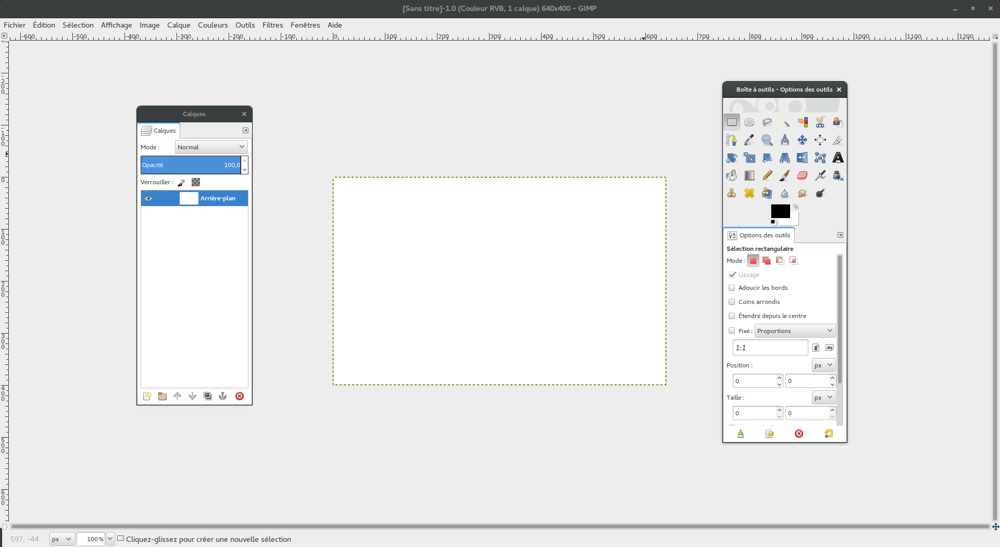
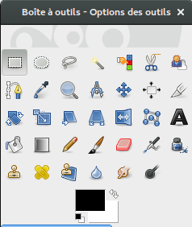
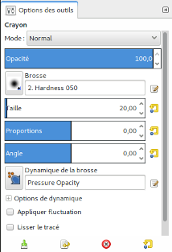
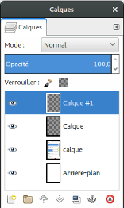
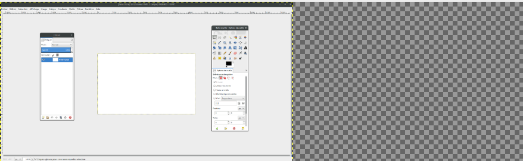
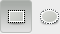
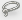

# GIMP

GNU Image Manipulation Program

---

## Installation

Pour **Linux** :

`sudo apt-get update`
`sudo apt-get install gimp`

Pour **Windows** :

[gimp.org/downloads](https://gimp.org/downloads)

---

## Présentation Générale

Gimp est un logiciel libre de manipulation et de retouche d'image. Il est plus ou moins l'équivalent de Photoshop fonctionnant sur tout type d'OS.

---

## Présentation de l'interface

***

L'interface est composé de 4 fenetres : la **boite à outils**, les **options de l'outil**, les **calques** et le **canevas**.

***

### Boite à outils

La boite à outil contient tout les outils permettant d emodifier une image : outil de sélection, de couleur, de peinture, de découpage, de remplissage, de clonage...

***

### Options de l'outil

Cette fenêtre permet de configurer l'outil sélectionné et différe en fonction de chaque outil. On peut par exemple y régler l'opacité d'un trait, le lissage, la police utilisé pour du texte...

***

### Calques

Cette fenêtre permet de gérer les calques c'est à dire les différentes couches de l'image qui sont les unes en dessous des autres. On peut y modifier l'ordre de superposition, son opacité, son nom, son groupe et on y dispose des mêmes options de modifications que sur l'image complète à travers le clique droit.

***

### Canevas et image

Le canevas représente l'espace de travail dans lequel vous évoluez, il est composé de votre image ainsi que d'éventuel espace libre.  

---

## Caractéristique d'une image

Les images possédent plusieurs caractéristiques que l'on peut modifier : le format, les dimensions, l'échelle et la transparence (alpha).

***

### Formats

**.jpg** : image simple, adapté aux photos.

**.png** : image permettant la transparence.

**.gif** : image animée.

***

### Dimensions

Hauteur et Largeur

Dans GIMP eut être exprimé en cm, mm, %, px...

***

### Scale

Ratio entre Hauteur et Largeur.

***

### Alpha

Le canal alpha représente la transparence dans une image, disponible uniquement en PNG.

---

## Redimensionnement

Il existe 3 espaces que vous pouvez redimensionner : le canevas, l'image ou bien un calque.

***

### Canevas

Le canevas représente votre zone de travail disponible. Vous pouvez le réduire ou l'augmenter en allant dans :

`Image > Taille du canevas`

***

### Image

L'image représente votre image compléte, incluant tout le canevas et les calques. On peut en modifier la dimension dans : 

`Image > Échelle et taille de l'image`

***

### Calque

Le calque est une couche de l'image on peut en modifier la dimension dans :

`Calque > Échelle et taille du calque`

Il faut bien sélectionner le calque que l'on veut modifier dans la fenêtre.

---

## Sélection, Découpage et Détourage

Il est essentiel de pouvoir sélectionner correctement un élément afin de pouvoir le découper pour soit le garder soit s'en débarasser.

Détourer signifie délimiter une forme sur son image afin de la supprimer ou l'extraire. Pour cela nous avons de nombreux outils.

Il faut toujours être sur le bon calque ayant l'élément que l'on souhaite sélectionner.

***

### Sélection géométrique

Permet de selectionner une forme rectangulaire ou éliptique.

***

### Lasso

Permet de selectionner une forme libre en plaçant des points.

Utile pour le détourage de formes complexes (visages, personne, explosions, chats...)

***

### Baguette magique

Permet de sélectionner une zone en fonction de sa couleur.

Utile pour sélectionner des zones lors de la réalisation de maquette.

***

### Ciseaux intelligents

Permet de sélectionner une zone en fonction de ses bords.

---

## Outils divers

Il existe une multitude d'autres outils pour le dessin, la modification de photo ou encore pour utiliser un filtre sur l'image.

***

### Dessin

**Crayon** : permet de tracer d'une manière "dure"

**Pinceau** : permet de tracer d'une manière "douce"

**Aérographe** : permet de tracer avec un variateur de pression

**Gomme** : gomme une zone (faire attention au calque sélectionné)

***

Les outils de dessins se servent des "brosses". Les brosses sont des formes soit pré existantes, soit à créer vous même.

N'hésitez pas essayer d'en construire une nouvelle !

***

### Modification de photo

Afin de rendre plus réelle une photographie que vous auriez retouché, par exemple avec l'ajout une image,

**Clonage** : l'outil de clonage permet de dupliquer une partie d'une image sur un autre endroit. Très utile pour compléter un fond : ciel, foret etc.

**Correcteur** : permet d'aténuer des irrégularités, utile lors de l'intégration d'une image.

**Outil de flou et de netteté** : permet de travailler le flou et donc de rendre une itnégration plus discrète.

***

### Les filtres

Dans la barre de menu vous avez le menu "Filtre". Vous disposez dans ce menu de toute une série de filtre à appliquer sur votre image ou sur une zone sélectionné : flous, bruits, relief....

---

## Transparence

Il existe plusieurs endroit où appliquer la transparence :
- sur une couleur de l'image
- sur le calque
- avec l'outil utilisé

***

### Image

Permet de remplacer une couleur par de la transparence :

`Couleurs > Couleur vers alpha`

***

### Opacité calques et outils

Vous disposez d'une barre de progression d'opacité pour chaque calque dans la fenêtre de gestion des calques.

Vous disposez de la même chose pour chaque outil dessinant sur l'image.

---

## Guide

Les guides permet de créer des lignes en pointillé sur notre zone de travail qui ne seront pas visible ensuite.

Cela peut être utile pour créer une maquette (wireframe).

***

### Utilisation

Il suffit de cliquer sur une des régles et de tirer la ligne à l'endroit voulu.

Il est également possible d'utiliser le menu 

`Image > Guides`

---

## Exercice

Détourer la silhouette d'une personne d'une photo et l'intégrer sur une autre.

Y ajouter des éléments (chats, explosions, fleurs...) en transparence.

Il faudra vou servir d'un outil de détourage, des calques, de l'opacité, de l'échelle d'un calque etc...

