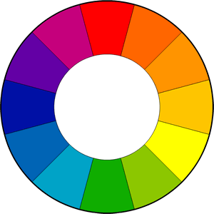
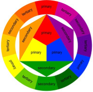
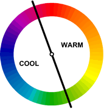
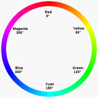
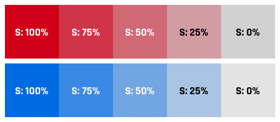
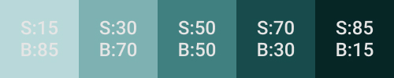
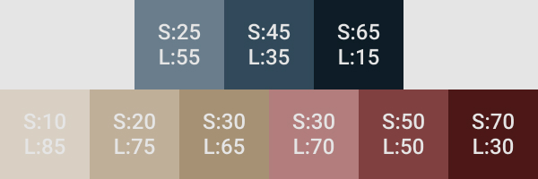
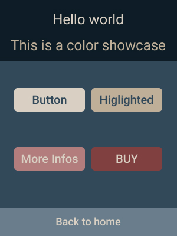

# Les couleurs
## (Théorie des couleurs & utilisation pour la conception d'Interfaces Utilisateurs)

---

## Généralités
Les couleurs sont fondamentales dans toute réalisation d'une interface utilisateur.

Elles peuvent servir, par exemple, à **définir une ambiance** ou **attirer l'attention**.

En sélectionnant les bonnes couleurs, on peut créer une ambiance _élégante_, _chaleureuse_ ou _calme_. 

Enfin, elles peuvent être l'un des éléments de design les plus efficaces !

***

### La roue des couleurs
Historiquement, l'une des premières théories sur les couleurs nous vient d'Isaac Newton, qui a défini qu'elles sont un mélange de lumières **rouges**, **vertes** et **bleues**. 

Il produisit, de cette théorie, la 1ère "roue des couleurs" :

***

### Evolution des systèmes de couleurs
Comme vu précédemment, le premier système de couleur est basé sur la lumière, avec une base RGB. Il en existe d'autres, qui ont différentes utilisations : 
- **CMY** pour l'impression : Cyan, Magenta, Yellow.
- **RYB** pour la peinture : Red, Yellow, Blue.

***

### La roue "classique"

La roue des couleurs a pour but de fournir des couleurs qui **se combinent bien ensemble**. 

Même s'il y a eu de nombreuses variations avec le temps, la version la plus commune est une roue de 12 couleurs, basée sur le modèle **RYB**, tel que suit :

***

### Couleurs primaires, secondaires et tertiaires
En RYB, les couleurs primaires sont : rouge, jaune et bleu.

Les couleurs secondaires (vert, orange et violet) sont obtenues par un **mélange de certaines couleurs primaires**.

Enfin, d'autres couleurs, dites tertiaires, sont obtenues par un **mélange de couleur primaire et de couleur secondaire**.

***

### Couleurs dites "chaudes" et "froides"
La roue des couleurs peut être séparée en ces 2 catégories.

Les couleurs **chaudes** sont dites vives et énergiques, alors que les couleurs **froides** donnent une impression de calme ou d'apaisement.

_(En outre, le blanc, le noir et le gris sont dites neutres.)_

***

### Signification des couleurs
Les couleurs ont des **significations**, il faut les sélectionner **en accord avec le thème ou l'ambiance**.

| Couleur | Signification |
| --------|---------------|
| Rouge   | énergie, passion, chaleur / sang, guerre, danger   |
| Jaune   | joie, optimisme / trahison, jalousie        |
| Vert    | nature, santé, jeunesse / inexperience, envie |
| Violet  | spiritualité, mystère, connaissance |
| Orange  | équilibre, vitalité, automne / désir, domination |

_Liste des significations sur [color-symbolism](https://www.wordpress-web-designer-raleigh.com/2015/04/color-in-web-design-color-symbolism/)_

---

## Harmonie des couleurs
Techniques basiques pour choisir un ensemble de couleurs.

***

### Couleurs complémentaires
Les couleurs dites "complémentaires" sont des couleurs **opposées** sur la roue.

Le **contraste** entre ces deux couleurs permet, par exemple, de bien faire ressortir une information.

_Note : il est difficile de les utiliser en grande mesure, il faut donc restreindre leur utilisation à des cas précis._

***

### Couleurs dites "analogues"
Ce schéma utilise des couleurs **très proches** sur la roue.

De fait, elles sont **assez ressemblantes**, et vont souvent **s'accorder correctement**, elles sont également dites harmonieuses et plaisantes à l'oeil.

***

### Triade de couleurs
Ce schéma utilise trois couleurs qui ont un **espacement égal et fixe** sur la roue.

Généralement, **le contraste** qui en ressort **est assez vif**, il faut donc sélectionner les couleurs avec attention.

_Note : Il existe une variante qui sélectionne 2 couleurs secondaires plus proches sur la roue._

***

### Rectangle de couleurs
Ce schéma utilise quatres couleurs arrangées en **paires de couleurs complémentaires**.

Il permet plus de **possibilités et de variations**.

_Note : Il existe une variante qui est un carré, il utilise donc un espace égal et fixe entre les couleurs._

***

### Notes sur les harmonies

* Utilisez une **couleur principale**, et d'autres pour l'accompagner. 

* Vérifiez qu'il y a **assez de contraste** entre les couleurs.

* Veillez à l'équilibre entre couleurs chaudes et froides.

---

## Système de couleurs avancé : HSB

***

### Le modèle HSB
**HSB** : Hue-Saturation-Brightness

(où _Hue_ signifie **teinte** et _Brightness_ signifie **luminosité**.)

Ce modèle est généralement plus compréhensible pour l'humain que le RGB, car les concepts de saturation et luminosité permettent de mieux saisir la **nature** d'une couleur, plutôt que par une combinaison de valeurs RGB.

***

### La teinte (Hue)
La teinte est représentée par un nombre de 0° à 360° (en degrés).

_Vous souvenez-vous de la roue des couleurs?_

La teinte est donc le **positionnement** sur la roue!

_Ici, nous n'avons pas de variation plus sombre/claire... c'est la qu'interviennent les autres composantes._

***

### La saturation
Représentée par un **pourcentage** de 0 à 100.

On peut voir la saturation comme la **quantité de couleur injectée dans le gris**.

- Saturation à 100% : couleur à son maximum de richesse.
- Saturation à 0% : version grise de cette couleur.

***

### La luminosité (brightness) - 1
Représentée par un **pourcentage** de 0 à 100, qui détermine **l'intensité de lumière émise**.

Sa compréhension est un peu plus "complexe" que la saturation, voyez donc :
- Luminosité à 0% : donne du **noir**. Peu importe la teinte ou la saturation.
- Luminosité à 100% : rend la couleur à sa **"brillance"** maximum. Elle donnera du blanc seulement SI la saturation est également à 0% (remember, car saturation à 0% donne la version grise de la couleur).

***

### La luminosité (brightness) - 2
Confus? Prenons un exemple!
Imaginons la luminosité comme une **ampoule** :
- 0% de luminosité = ampoule éteinte -> salle dans le noir.
- 100% de luminosité = ampoule au maximum -> salle fortement éclairée par la **couleur de la lumière**. ET SI la lumière est blanche, la luminosité sera 100% blanche.

***

### Synthèse du modèle HSB
Ainsi, avec ce modèle, nous pouvons décrire une couleur avec 3 valeurs : 

- **Teinte** (Hue) : de 0° à 360°, couleur donnée par la **position sur la roue**.
- **Saturation** : de 0 à 100%, quelle **quantité de couleur "pure"** injectée.
- **Luminosité** (Brightness) : de 0 à 100%, **l'intensité** de la lumière émise. 

---

## Variations de couleurs

***

### Variations de couleurs : selon le modèle HSB

Pour obtenir des variations de couleurs, il est commun de "jouer" avec les différents composantes de ce modèle. Tout d'abord avec la **teinte** : 

- Si l'on déplace la **position sur la roue**, on obtient des couleurs différentes, on peut ainsi avoir des variantes d'une couleur principale.

_(Mais tel quel, il n'est pas si aisé de trouver des couleurs qui s'accordent...)_

***

### Variations de couleurs : saturation et luminosité

Pour obtenir une **variation claire** : 
- Baisser la saturation
- Augmenter la luminosité

Pour une **variation foncée**, on fait l'inverse : 
- Augmenter la saturation
- Baisser la luminosité

***

### Exemple
En partant d'une **couleur principale**, et en effectuant les actions citées à la slide précédente, on peut obtenir des variations de cette dernière qui **s'accordent bien** : 

---

## Les palettes de couleurs

***

### Pourquoi utiliser une palette de couleur ?

- Limite le nombres de couleurs, cela **cadre la réalisation**.

- Permet de mettre en avant la **couleur principale** (pour le branding, ou l'ambiance du site, par exemple).

- Ajoute de la **consistance** au design (fondamental!)

***

### Palette de couleur pour le web design
Voyons ce qu'il nous faut pour une **palette assez complète** : 
- **Identité** : 1 couleur principale, 1 à 2 couleurs secondaires, ainsi que leurs variantes claires/foncées.

- **Call-to-action** : 1 couleur, dont le **contraste** avec les autres doit être visible (!). Les variantes claires/foncées sont optionelles _(selon le besoin)_.

- **Messages** (optionnel) : couleurs **claires** usuelles pour les errors (rouge), success (vert), infos (bleu) et warnings (jaune).

***

### Exemple de palette simple
Couleurs et variantes : 
- **Principale** : bleu grisé 
- **Secondaire** (ici, complémentaire) : Beige 
- **CTA** : bordeau clair

***

### Utilisation de la palette
Une fois les couleurs déterminées, on peut effectuer rapidement un premier jet pour voir si les couleurs s'accordent : 

---

## Outils

- [Coolors](https://coolors.co/) : assiste la sélection de couleurs.
- [Adobe Color](https://color.adobe.com/fr/create/color-wheel/) : création d'une harmonie de couleurs.
- [Paletton](http://paletton.com/) : création de palettes plus complexes
- [Figma](https://www.figma.com/files/recent) : maquettage/prototyping
- [Webgradients](https://webgradients.com/) : dégradés pour backgrounds
- [Colorpalettes](https://colorpalettes.net/) : palettes de 5 couleurs harmonieuses