# Polices


---


## Propriétés des polices
Baseline, height, ascenders/descenders, weight, ...


***


### Baseline
La **baseline** représente la _ligne imaginaire_ sur laquelle le texte repose. 

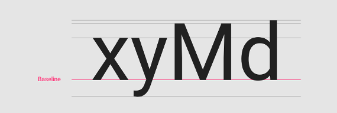


***


### Cap-height, x-height
La **cap-height** est la hauteur d'une lettre capitale (M, I, ...) à partir de sa **baseline**.

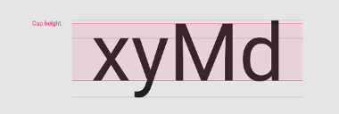

La **x-height** est la hauteur de la lettre "x" en minuscule, à partir de sa **baseline**.

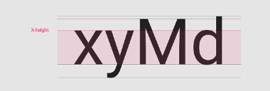


***


### Ascenders & descenders
L'**ascender** (ascendante) et le **descender** (descendante) d'une lettre sont les traits qui peuvent **dépasser de la hauteur de majuscule ou de la baseline**.

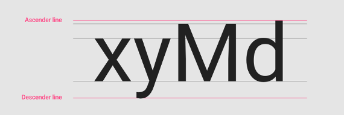

_Dans certains cas, si l'espacement entre les lignes (line-height) est trop petit, ces ascendantes/descendantes peuvent se croiser._


***


### Weight
Le **weight** (poids) d'une police est son épaisseur.

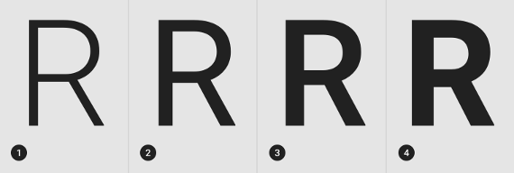

Les épaisseurs les plus courantes sont : 
1. **Light** (légère)
2. **Regular** (normale)
3. **Medium** (moyenne)
4. **Bold** (gras)


---


## Typologie et types de polices
Serif, Sans-serif, Display, Handwritting & Monospace


***


### Serif
Le **serif** est une **forme ou une projection** qui apparait au début ou à la fin d'un caractère. Plus généralement, c'est une **catégorie de polices**, dont les caractères possèdent cette forme supplémentaire.

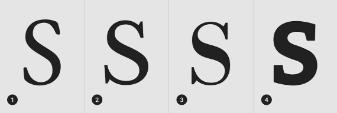

Ici sont présentés différents types de polices à Serif :

**Old style** (1), **Transitional** (2), **Neoclassical** (3), **Slab** (4)


***


### Sans-serif
Les polices dites "Sans-serif" sont simplement celles ne possédant pas de **serifs**, avec donc un tracé plus _direct_.

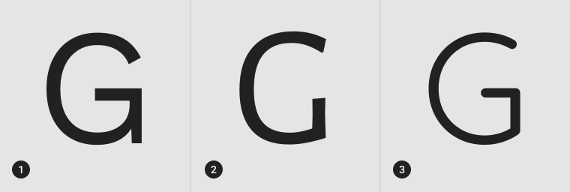

Les différents types de polices sans-serif ici sont : 

**Grotesque** (1), **Humanist** (2), **Geometric** (3)


***


### Monospace
Le principe des polices **Monospace** est une **largeur similaire pour tous les caractères**.


***


### Handwriting
Ce sont des polices _peu conventionnelles_ qui reproduisent différents types d'écritures **faites à la main**.

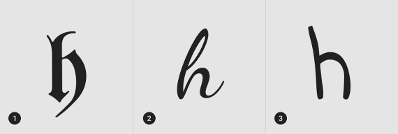

Les trois types présentés ici sont : 

**Black letter** (1), **Script** (2), **Handwriting** (3)


***


### Display
Il s'agit d'une catégorie plus _diverse_ de polices généralement **utilisables à grande taille** et au **style particulier**.


_(Il n'y a pas de sous-catégories)_


---


## Combinaisons de polices


***


### Préambule - Quelques recommendations
- Pour un site ou une application, on n'utilisera généralement **pas plus de 2 polices**.

- Les types de polices hors _Serif_ et _Sans-serif_ sont **généralement déconseillées**, sauf pour **donner une identité visuelle particulière**.

- Chaque police doit avoir une **utilité assez précise**, on considère généralement une police pour les titres et une pour le texte (& les inputs, labels, ...).


***


### Trouver des combinaisons
Pour trouver des **combinaisons harmonieuses**, on part généralement d'une **police principale** (une police favorite ou dans un thème particulier), à laquelle on associe une autre.

Au pifomètre, il n'est pas évident de trouver une **bonne association**, pour cela, on peut utiliser des outils en ligne : 
- [Google Fonts](https://fonts.google.com/) propose, pour une police donnée, d'autres qui s'associent bien.
- [Font Pair](https://fontpair.co/) est un grand catalogue de combinaisons.
- [Canva Font Combinations](https://www.canva.com/font-combinations/) propose des polices pour accompagner une principale.


---


## Propriétés de lisibilité
Espacement des lettres, longueur et hauteur de ligne


***


### Espacement des lettres (letter-spacing)
**L'espacement entre chaque lettre** peut être spécifié en CSS (letter-spacing), dans certains cas, il est utile de le contrôler.

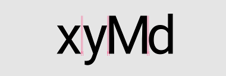 

VS 

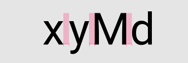


***


### Longueur de ligne (line-length)
Il est recommandé d'avoir pour chaque ligne **jusqu'à 60 caractères**. En outre, pour les paragraphes qui en auraient plus, il est conseillé d'**augmenter la hauteur de ligne**.


***


### Hauteur de ligne (line-height)
Cette propriété est **l'une des plus communes** à modifier pour **améliorer la lisibilité** du texte.

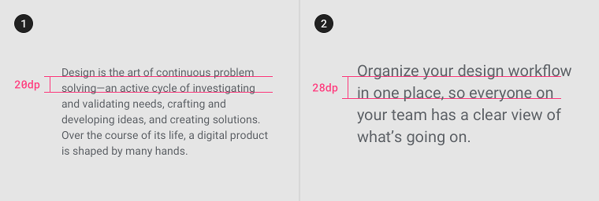


***


### Bonne pratiques de typologie en CSS
Il est assez fréquent de spécifier certaines propriétés CSS sur le _html_ pour **appliquer uniformément une valeur de base**. On utilisera par la suite des valeurs en _em_ ou _%_ pour **dériver de la valeur de base**.

```
html {
    line-height: 1.15;
    font-size: 14px;
}
```