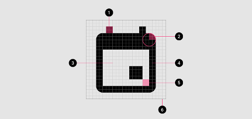
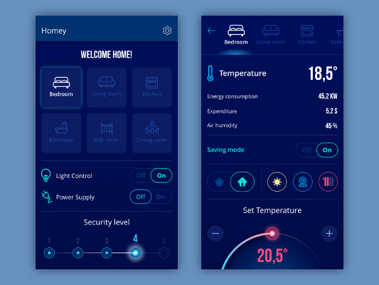
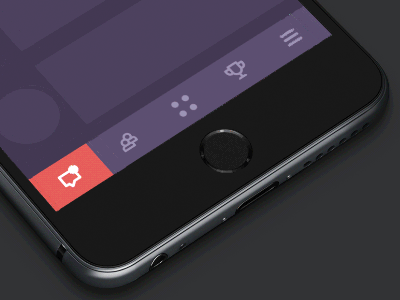
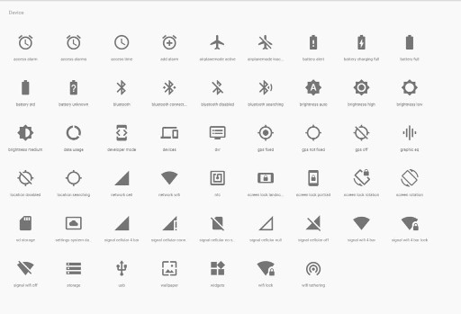
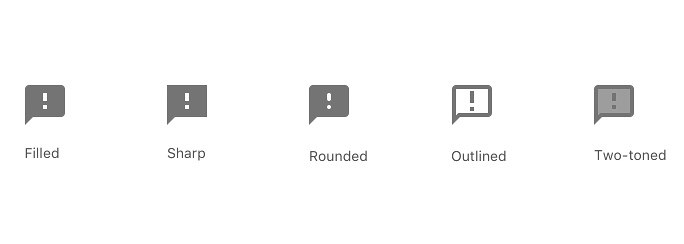
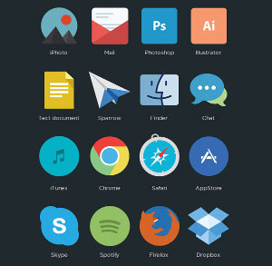
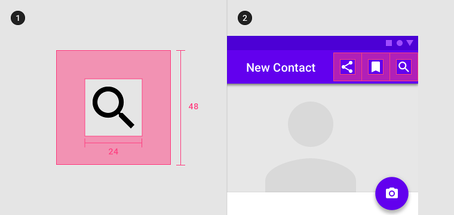

# Icônes sur le web


---


## Définition, classification & propriétés


***


### Définition
Une icône est une **représentation visuelle** d'un **objet**, d'une **action** ou d'une **idée**. 

On en dinstingue trois types principaux : 

- **Ressemblance** : décrit _(un objet ou un concept)_ directement par l'**aspect visuel**.

  


***


- **Référence** : décrit _(un objet ou un concept)_ par **référence ou analogie**.


- **Arbitraire** : décrit _(un objet ou un concept)_ par **convention** ou représente une **marque**.


***


### Propriétés des icônes



1. **Trait final**, se trouve _au-delà_ de la bordure principale.
2. **Coin**, souvent arrondi.
3. **Zone de "contre"**, représente l'intérieur de l'icône.
4. **Bordure principale**.
5. **Contre-trait**, partie interne de l'icône, opposée au coin.
6. **Zone de délimitation**.


---


## Types d'icônes - basé sur la fonction
Clarification, interactivité, décoration, branding


***


### Clarification
Ces icônes ont un but explicatif, elles **assistent le texte** pour rendre **plus rapide la captation** de l'information. 



_En accompagnant le texte, on **renforce la compréhension**._


***


### Interactivité
Elles prennent part à **l'interactivité générale** et **supportent la navigation**. 



Généralement **cliquables (ou tappables)**, elles effectuent l'action symbolisée par l'icône.


***


### Décoration & Branding
- Les icônes **décoratives** ont un rôle **plus esthétique que fonctionnel**.

- Leur style sera souvent **adapté à l'audience ciblée** et elles jouent un rôle important dans **l'attraction et la rétention** de l'utilisateur.

---

- Les icônes de **branding** sont spécifiques à une identité visuelle. 

- Elles sont souvent composées d'un logo, d'une lettre ou de la mascotte. 


---


## Types d'icônes - basé sur le style
Glyphes, Flat


***


### Les glyphes - Définition
Utilisent des **formes simplifiées et universelles** afin d'être **flexibles et reconnaissables**, elles assistent l'information et la navigation.




***


### Les glyphes - Variations de design
On retrouve ici principalement 3 types de design :



- **Filled** : intérieur rempli, couleur uniforme.
- **Outlined** : bordure principale, intérieur non rempli.
- **Two-Toned** : marquage entre la bordure principale et le centre, rempli d'une autre couleur. _(ceci peut-être spécifique au material design)_


***


### Le style "Flat"
- Ce style est généralement situé entre le **fonctionnel** et le **décoratif**. 



- Elles jouent un rôle moindre dans la navigation, mais permettent d'élaborer des **éléments visuels plus complexes**.


---


## Règles et bonnes pratiques


***


### Règles
- Ne pas **mélanger les styles d'icônes** (de façon inconsistante).

- Utiliser les icônes **les plus universelles**.

- Les icônes **ne remplacent pas le texte** !

- N'en n'abusez pas!


***


### Bonnes pratiques

- Laissez **suffisamment de place autour de chaque icônes** (notamment pour une utilisation mobile).




***


- Pour de la navigation avec des icônes :
    - **outlined** pour un élément _non actif_ 
    - **filled** pour un élément _actif_.

 

- Eviter les icônes **à plusieurs sens** (étoile, coeur, ...).

- Faire une liste des **icônes nécessaires à un projet**.


***


### Principes d'une bonne icône
Plus généralement, on reconnait plusieurs aspects à une **bonne** icône : 

- Claire
- Chargée de sens
- Reconnaissable
- Simple
- Consistante
- Etirable/Flexible
- Attractive et non-offensive


---


## Outils
- [Fontawesome](https://fontawesome.com/)
- [Material IO Icons](https://material.io/tools/icons/?style=baseline)


---


## SVG

Le SVG c'est quoi ?


***


C'est la définition d'une image sous la forme de vecteurs graphiques.

```xml
<?xml version="1.0" encoding="UTF-8" ?>
<svg width="391" height="391" viewBox="-70.5 -70.5 391 391" xmlns="http://www.w3.org/2000/svg">
  <rect x="25" y="25" width="200" height="200" fill="lime" stroke-width="4" stroke="pink" />
  <circle cx="125" cy="125" r="75" fill="orange" />
  <polyline points="50,150 50,200 200,200 200,100" stroke="red" stroke-width="4" fill="none" />
  <line x1="50" y1="50" x2="200" y2="200" stroke="blue" stroke-width="4" />
</svg>
```


***


## Pourquoi on l'utilise ?
Ça permet de définir une image sous une forme différent qu'une liste de pixels. Aussi, ça améliore la compatibilité avec les différentes résolutions des appareils.


---


## Créer ses icones

Sur Figma, on peut créer des icones et les exporter en SVG. On peut aussi en faire des composants pour les réutiliser plus tard.


***


## Exemple

Live graphisme !

1. Définir le but de l'icone
2. Faire des recherches sur comment représenter cette action
3. Définir le style de l'icone
4. Créer l'icone !


---


## Illustrations

Beaucoup de sites utilisent des illustrations SVG. Savoir en faire peut vous aider à apporter une touche intéressante à votre site.


***


## Exemple

Choisissons une image sur google et faisons en une illustration !


---


## FIN !