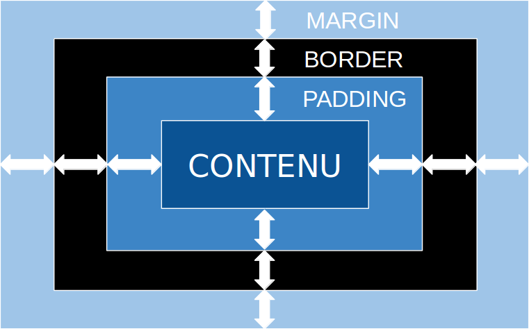

# Layout & Espace

Vous vous souvenez de ça ? Gardez le en tête !

***

Le principe d'espacement des éléments est constitué de trois règles principales :
- Il doit être constant (mêmes espacements pour les mêmes types d'éléments)
- L'unité utilisée est différente selon les types d'espacements
- Il doit être fait par rapport au multiple d'une base

---

## Le vide

Le vide en design créé du repos pour l'utilisateur. Si l'espace est trop rempli, l'information passera difficilement. Il est préférable de faire exprès de créer de l'espace non rempli. Ne vous forcez pas à remplir l'espace.

***

***

---

## Micro & Macro Space

En design, on parle généralement de deux types d'espacements : Micro & Macro.

---

## Microspace

C'est le terme que l'on utilise pour spécifier l'espacement légér entre petits éléments, le tout dans un contexte précis.

***

Laquelle vous préférez, et pourquoi ?

***

L'espacement entre les petits éléments est différent. Lesquels ?

***

Cela hiérarchise l'information entre le titre et le sous-titre, les photos de profil et les noms.

En hiérarchisant l'information comme ceci, on créé un sentiment d'harmonie visuelle.

---

## Macrospace

C'est quant à lui le terme utilisé pour désigner les espaces entre éléments plus importants. Il désigne l'espace dit "négatif" ou "vide" entre les éléments comme les colonnes, les paragraphes, photos, etc.

C'est lui qui guide le regard de l'utilisateur.

***

***

---

## Les lois de Gestalt

***

Gesalt vient de l'allemand et veut dire "forme". C'est une liste de principes de perception visuelle développés par des psychologues allemands dans les années 20.

C'est basé sur la citation suivante : "an organized whole, is perceived as greater than the sum of its parts"

***

Ce sont des lois basées sur 4 principes :

***

## Émergence

C'est le principe de voir un élément d'abord dans sa forme globale. Même s'il est composé de plein de petites parties simples.

***

## Réification

C'est la capacité à reconnaitre un élément, même s'il en manque des parties.

***

## Multi-Stabilité

C'est la capacité à interpréter une image ou une illustration de différentes manières.

***

## Invariance

On peut reconnaitre des éléments peu importe leur inclinaison.

---

---

## On peut appliquer ces lois à l'UI

On les applique sous 7 principes :
- Proximity (Proximité)
- Common region (Regroupement)
- Similarity (Similitude)
- Closure (Clotûre)
- Symmetry (Symétrie)
- Continuation (Continuité)
- Common fate (Destin Commun)

---

## Proximity

Les éléments proches les uns des autres sont perçus comme étant plus liés que ceux éloignés les uns des autres.

***

## Appliqué à l'UI

On utilise ce principe pour regrouper des informations similaires, organiser le contenu ou désencombrer des layouts.

Comme le principe l'explicite, les éléments qui sont liés dans le sens, doivent être proches les uns des autres.

Le vide joue un rôle vital ici, il a pour but de guider l'oeil, de hierarchiser l'information et rendre le scan visuel de la page facile à faire.

***

---

## Common Region

Les éléments groupés avec une bordure sont considéré comme étant liés.

***

## Appliqué à l'UI

On l'utilise pour à la fois regrouper du contenu lié, mais aussi pour séparer ce qui ne l'est pas. Ça aide beaucoup sur la capacité d'un utilisateur à scanner une page.

On peut l'utiliser avec différents séparateurs :
- Lignes
- Couleur
- Forme
- Ombres

***

---

## Similarity

Des éléments partageant des caractéristiques visuelles proches seront plus liés que ceux n'en partageant aucune.

***

## Appliqué à l'UI

On a tendance à regrouper les éléments se ressemblant. Ils peuvent aussi servir à la même chose (composants).
Il y a différentes façons de rendre des éléments similaires, et donc, liés. La couleur, la taille, la forme, la texture, dimensions, orientation, ... Avec certains plu importants que d'autres (couleur > taille > forme).

***

__Les anomalies__ : Lorsqu'un élément est considéré comme ressemblant à un autre, on peut mettre l'accent sur une petite différence pour créer du contraste. Tout ceci dans l'objectif d'attirer l'attention de l'utilisateur (CTA, etc.) tout en assistant sur la capacité à scanner la page.

***

---

## Closure

C'est lorsqu'un groupe d'élément, créé une forme reconnaissable dans son ensemble. Ce principe s'applique aussi lorsque l'objet est incomplet.

***

C'est le principe utilisé pour faire ce genre d'avatars.

***

## Appliqué à l'UI

C'est un principe utilisé dans la création de logos pour réduire la surcharge visuelle.

Il permet de réduire le nombre d'éléments ou la complexité et est principalement utile lorsque l'on veut renforcer un concept dans un espace restreint.

***

---

## Symmetry

Les éléments étant reliés par symétrie ont tendance à sembler être lier.

***

## Appliqué à l'UI ?

Les éléments symétriques sont simples, harmonieux et plaisant visuellement.
On recherche souvent cette stabilité lorsque l'on regarde une page web.
C'est un principe que l'on utilise lorsque l'on veut être efficace ou que l'on a beaucoup de contenu (journaux en ligne, etc.)

Elles ont le désavantage d'être statiques et un peu dénuées d'intérêt.

***

L'utilité est aussi dans le placement d'éléments asymétriques lorsque l'on a une interface qui l'est totalement, très utile pour attirer l'attention sur un CTA par exemple.

***

---

## Continuation

Les éléments qui suivent une formation sous forme de ligne ou de colone (parfois courbée légèrement) sont plus liés que ceux placé sous forme de ligne aléatoires.

***

## Appliqué à l'UI

Les éléments qui se suivent en ligne sont perçus comme groupés. Plus l'allignement est simple à comprendre, plus ces derniers sont liés. Notre cerveau préfère le chemin avec le moins de resistance.

Cela nous permet de suivre un mouvement simplement et de capter l'information sur la page.

Ce principe facilite le groupement d'informations, en créant un ordre hierarchique. La fin de cette liste, signifie généralement la fin d'une section.

***

---

## Common Fate

Les éléments allant dans la même direciton sont plus liés que ceux allant dans des directions divergeantes.

***

## Appliqué à l'UI

Si des éléments différents changent en même temps (couleur, dégradé, fade, etc.) alors ils sont liés. Ce mouvement peut-être induit pas d'autes éléments visuels.

Si les éléments changent de manière synchronisée, à la même vitesse et dans la même direction leur lien est accentué.

***

---

Ce sont des règles, basées sur des théories psychologiques. Ce sont actuellement celles qui sont le plus fondées concernant le design d'interfaces numériques.

Elles ne sont pas à suivre à la lettre mais permettent de nous aider lorsque l'on débute ou que l'on analyse une maquette.

---

Ne vous forcez pas à remplir l'espace. Laissez du vide.

---

## Sources : 

- [https://www.justinmind.com/blog/your-guide-to-space-and-layout-in-ui-design/](https://www.justinmind.com/blog/your-guide-to-space-and-layout-in-ui-design/)
- [https://www.justinmind.com/blog/how-to-improve-ux-using-gestalt-principles/](https://www.justinmind.com/blog/how-to-improve-ux-using-gestalt-principles/)
- [https://medium.muz.li/gestalt-principles-in-ui-design-6b75a41e9965](https://medium.muz.li/gestalt-principles-in-ui-design-6b75a41e9965)
- [https://www.ux-republic.com/ux-posters-6-lois-de-gestalt-illustrees/](https://www.ux-republic.com/ux-posters-6-lois-de-gestalt-illustrees/)
- [https://www.ux-republic.com/theorie-de-gestalt-psychologie-de-forme/](https://www.ux-republic.com/theorie-de-gestalt-psychologie-de-forme/)