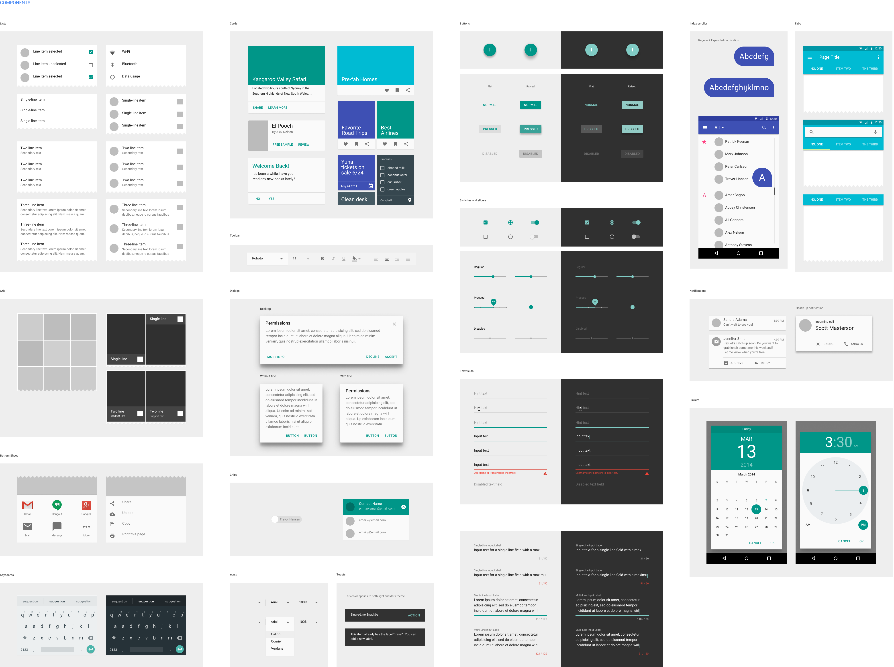

# Composants

Vous vous souvenez d'une des lois de Gestalt qui s'appelle Similarity ?

***

C'est le principe des composants.

Un composant est un ensemble de règles de représentation pour des éléments à but similaires comme des boutons, des liens, des titres, des cartes, des menus, etc.

Le principe est de reposer l'oeil et de faciliter la lecture en décrivant la fonction d'un élément par un code visuel. Cela nous permet de simplifier l'interface et de la rendre homogène.

***

---

## Wireframe

Pour repérer les composants et où ils seront positionnés, on fait généralement ce qu'on appelle une wireframe.
Ça ressemble plus ou moins à ceci : 

***

Il y a peu de règles de représentations génériques : 
- Représenter sous forme de bloc de couleur uni les textes
- Représenter strictement les espaces et les vides
- Représenter les images / vidéos / média sous forme de rectangle avec une croix
- Nuancer la couleur des éléments pour indiquer l'importance
- NE PAS METTRE DE STYLE

***

Ne pas mettre de style ne veut pas dire "faire moche". Par exemple, ceci est aussi une wireframe :

---

## Extraire les composants

***

Une fois la wireframe terminée, on repère les éléments qui se ressemblent et on les liste pour les designer plus tard.

***

## Réperer les composants

***

## Repérer les composants pt. 2

***

À vous !