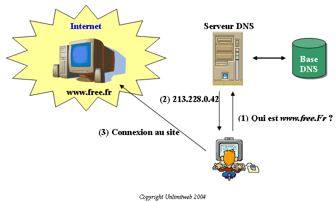

# Le fonctionnement d'internet
## Le modèle client-serveur

---

## Généralités
Internet fonctionne sur un modèle client-serveur

Qu'est ce qu'un client ?

Qu'est ce qu'un serveur ?

Dans quelles interactions peut on retrouver ce modèle ?

---

---

### Les serveurs web
- Servent à “servir” les pages demandées par le client

- Fonctionne différemment pour les sites et les applications web

- On peut s’y connecter de différentes manière pour différents usages : SFTP, SSH, HTTP, HTTPS...

---

### Les noms de domaines 

- Top-Level Domain

- Second-Level Domain

- Third-Level Domain (sous-domaine)

**Example** : blank.bellevillecitoyenne.fr

**Exercice** : Trouver les informations d’un propriétaire de nom de domaine à l’aide du WHOIS.

---

### Adresses emails

En achetant un nom de domaine il est possible de créer des adresses mails de la forme : contact@nomdedomaine.fr en utilisant un serveur mail.

---

### Les bases de données relationnelles

- Fonctionne plus ou moins comme un tableur

- Nécessite un serveur et un client

- Des logiciels ou application web de visualisation existent

Modèle Base > Tables > Colonnes > Lignes

**Exercice** : imaginer comment pourrait être structuré une base de donnée pour un blog

---

### Les différents types d’hébergements en fonction des besoins :

- Mutualisé : site web statique ou dynamique
- Virtual Private Server (VPS)
- Serveur dédié
- Différence wordpress.com / wordpress hébergé / SaaS

**Exercice** : Trouver l’hébergement convenant au besoin pour différents sites existants.

---

### EXERCICE

Réaliser un schéma le plus détaillé possible des différentes interactions clients-serveur lorsqu’un utilisateur se connecte sur un site de type blog. Y inclure les différents concepts vu précédemment.

---

### Installer un serveur web local

***

L’objectif est d’installer un serveur permettant de faire fonctionner wordpress sur son ordinateur. Nous aurons besoin de :

- Apache (serveur web)
- PHP (afin d’interpréter le langage)
- MySQL (gestionnaire de base de données)

***

Plutôt que d’installer ces logiciels uns à uns nous allons installer WAMP/MAMP/LAMP qui les regroupe et propose une interface graphique.

http://www.wampserver.com/

***

Une fois installé, WAMP créera un dossier situé sur 

c:\wamp\www

C’est ce dossier qui sera “servi” par Apache, c’est à dire qu’il sera accessible à travers une URL.

**Exercice** : lancez votre serveur et rendez vous sur localhost, ajoutez un fichier dans le dossier www et rechargez localhost. Que remarquez-vous ?

***

Afin de faire fonctionner correctement WordPress il est nécessaire de modifier la configuration de PHP. Celle ci se trouve dans le fichier php.ini, vous pouvez trouver ce fichier en cliquant  sur phpinfo(). 

Il vous faudra modifier cette ligne : 

**upload_max_filesize**

Et lui donner une valeur supérieur à 2M.

***

Nous allons maintenant préparer notre serveur à l’installation d’un wordpress tout neuf.

1 / Créer une base de données pour votre wordpress à l’aide de phpmyadmin.

2 / Dézippez les fichiers wordpress dans un nouveau dossier situé dans c:\wamp\www\

3 / Configurez wp-config-sample.php afin que wordpress puisse se connecter à la BDD. Le renommer en wp-config.php

4 / Rendez-vous sur localhost/nouveau_dossier avec votre navigateur afin de terminer l’installation.

***

Nous allons faire une installation d’un wordpress sur un serveur distant.

Téléchargez filezilla, installez-le.

Filezilla est un client FTP, il va nous permettre de nous connecter sur un serveur et d’y ajouter des fichier.

**Exercice** : Installer un nouveau wordpress sur ce serveur.

***

**Exercice** : Installer un CMS différent de wordpress sur votre serveur local.
