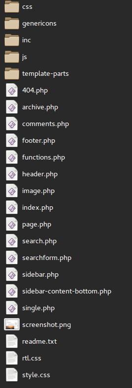

# Les thèmes
## Création de thème enfant


---


## Généralités
Wordpress fonctionne avec des thèmes. Ces thèmes bien que souvent de bonne qualité contraignent le développeur.

Il est compliqué de réalisé exactement une maquette en se basant sur un thème existant.


***


### Les thèmes enfant
Un thème enfant se base toujours sur un thème parent. N'importe quel thème est un thème parent.

La création d'un thème enfant va nous permettre de modifier, soit à la marge, soit de manière extensive un thème déjà existant.

***


### Choix du thème
Dans la transformation d'une maquette en thème enfant il sera important de choisir un thème parent se rapprochant le plus possible de la maquette.


***


### Arborescence
Chaque thème est composé d'une série de fichier, plus ou moins importante en fonction du thème, découpé un composant.

On disposera ainsi d'un fichier pour le header, d'un pour l'affichage des articles, d'un pour la barre de recherche etc...


***





***


### Modification direct d'un thème
Il est déconseillé de modifier un thème directement sans en faire de thème enfant. En effet, une mise à jour du thème supprimera toutes les modifications faites.


---


## Création d'un thème enfant
Afin de pouvoir modifier un thème il faut donc déclarer un thème enfant.

Pour se faire la création de deux fichiers (minimum) sera nécessaire.

Il faudra tout d'abord créer un nouveau dossier du nom de notre thème enfant dans le dossier themes de wordpress.


***


### functions.php
Ce fichier est composé de différentes fonction permettant de faire tourner le thème. Nous aurons besoin pour le thème d'un petit bout de code nous permettant d'appeler la nouvelle fiche de style.

```<?php
/**
** activation theme
**/
add_action( 'wp_enqueue_scripts', 'theme_enqueue_styles' );
function theme_enqueue_styles() {
 wp_enqueue_style( 'parent-style', get_template_directory_uri() . '/style.css' );

}```


***


### style.css
Le fichier css permettra de déclarer le thème. Le CSS doit être précédé d'un commentaire de ce type :

```
/*
Theme Name: Nom du thème enfant
Description: description du thème
Author: Auteur
Template: nom du dossier du thème parent 
Version: 1.0
*/
```

Il suffira ensuite d'activer le thème enfant dans le back office de wordpress.


***


### Modification du thème
Le thème enfant prendra en compte tout les fichiers du thème parent qui ne sont pas dupliqué sur le thème enfant. 

Ainsi si nous voulons modifier le fichier header.php il suffira de le copier depuis le theme parent vers le thème enfant et de le modifier.

Les fichiers présents dans le thème enfant auront toujorus l'ascendant sur ceux du thème parent.


---


## Les fonctions wordpress


***


### Le codex
Vous pouvez retrouver dans la documentation wordpress l'ensemble des fonctions disponibles. 

Ces fonctions vont permettre, par exemple, de récupérer les articles, récupérer les pages, les zones de widgets, les menu, les images etc...

Il faudra ensuite les intégrer dans les fichiers de thèmes.

Le plus simple étant de se baser sur des fichiers de thème déjà existants afin de les modifier.
