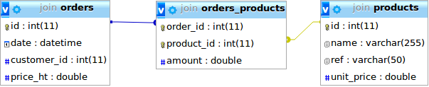

## SQL : Jointures et Relations


---


SQL nous permet de gérer des données **relationnelles**, c'est à dire des données ayant des liens forts entre elles.

Dans ce cours nous allons donc voir comment représenter ces relations, et les exploiter.

Ce cours utilise une base de données contenant des tables (_customers_, _products_, _orders_ décrites en [annexe](schema.sql)).


---


## Un nouveau type de clé

Nous avons déja vu la clé **primaire** (`PRIMARY KEY`) qui représente l'identifiant d'une table.

Une clé **étrangère** (`FOREIGN KEY`) indique qu'une colonne d'une table représente l'identifiant d'une ligne dans une autre table.

Cela va nous permettre de créer des relations entre tables.

La donnée de toutes les tables et leur relations s'appelle le **schéma** de la base de données.


***


On écrit :
```
CREATE TABLE t1
(
id int NOT NULL,
t2_id int NOT NULL,
PRIMARY KEY (id),
FOREIGN KEY (t2_id) REFERENCES t2(id)
)
```
Ou (après la création de la table) :
```
ALTER TABLE t1 ADD CONSTRAINT fk_name FOREIGN KEY (t2_id) REFERENCES t2(id)
```


***


Définir une clé etrangère nous permet d'assurer des **contraintes d'intégrités** sur notre base de données.

Elle assure que la donnée référencée existe dans la table cible, et que faire lors de sa suppression.

On ne pourra donc pas :
- Supprimer une donnée liée à d'autres
- Insérer une donnée qui référence une ligne qui n'existe pas.


---


## Type de relations

Grâce au clés étrangères on peut modéliser plusieurs type de relations :
- Un-à-Plusieurs (One-To-Many)
- Plusieurs-à-Plusieurs (Many-To-Many)
- Un-à-Un (One-To-One)


***


### One-To-Many

C'est le cas le plus répandu : définir une clé etrangère indique qu'un élément de la table est lié à plusieurs éléments de la table référencée.


(Un client peut avoir plusieurs commandes)


***


### One-To-One

C'est cas spécifique du cas précédent, ou la clé etrangère est unique sur la table.

C'est un cas très peu utilisé.


***


### Many-To-Many

Pour définir une relation Many-To-Many, il faut créer une _table d'association_.

Elle référence des lignes de 2 tables, et chaque ligne de la table représente une association One-To-One.



(Une commande a plusieurs produits et un même produit peut être dans plusieurs commandes).


---


## Les Jointures


Les clés étrangère nous permettent d'exprimer des relations entre tables, mais cela ne sert à rien si on ne peut pas requêter plusieurs tables.

Pour cela on dispose d'un outil très puissant en SQL : les **jointures**.

Elle vont nous permettre de lier (joindre) deux tables dans une même requête.


***


### Jointure classique

Pour joindre deux tables, on utilise les mot-clés `JOIN` et `ON`.

- On indique avec `JOIN` la table à joindre à la requête.
- On indique avec `ON` la condition pour lier les lignes des deux tables.

La requête retournera uniquement les couples de lignes vérifiant la condition :  c'est ce qu'on appelle une jointure interne.


***


Exemple :
```
SELECT * FROM orders o JOIN customers c ON o.customer_id = u.id
```

Cela va retourner une ligne pour chaque commande et le client associé.

`o` et `u` sont les alias des tables _orders_ et _customers_ respectivement.


***


## Jointures externes

Les jointures externes sont des jointures ou l'on peut récuperer des données qui ne respectent pas la condition de jointure.

Elle permettent de récuperer des données de manière très puissante.

Exemples :
- [LEFT JOIN](https://sql.sh/cours/jointures/left-join)
- [RIGHT JOIN](https://sql.sh/cours/jointures/right-join)
- FULL JOIN
