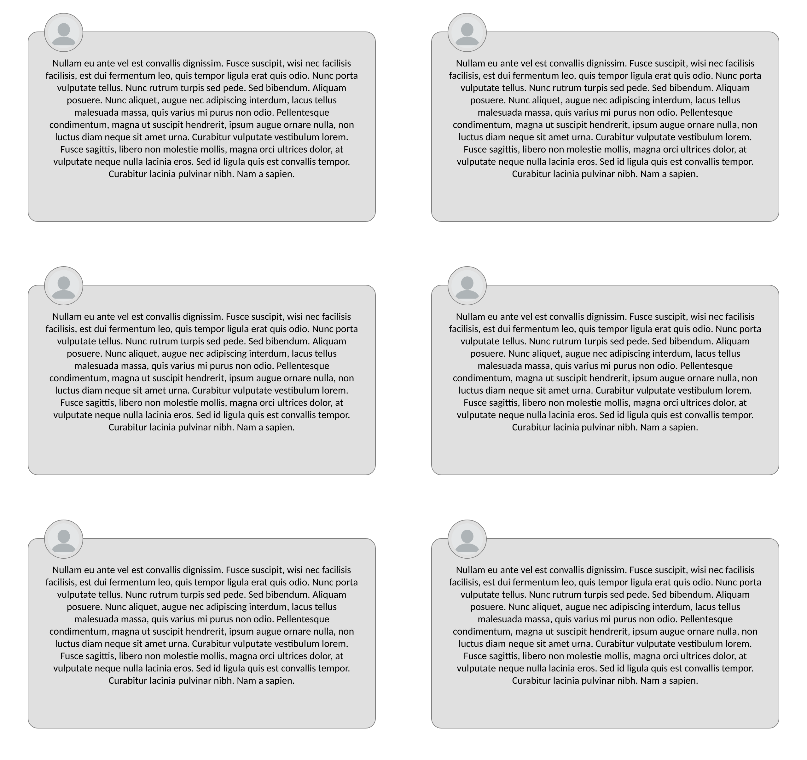

# CSS > Approfondissement > Positionnement > Exercice 1

Le but est de créer des cartes (modales), qui lorsqu'il y en a plusieurs se comportent correctement

On va procéder par étapes et d'abord créer la-dite modale et la placer au centre

  * Créer une div de 250px de haut et 500px large que vous centrez dans la page (en hauteur et en largeur)
  * Lui donner une bordure de 1px grise et arondie de 12pt
  * Insérer cette image dans la div : [https://cdn.pixabay.com/photo/2015/10/05/22/37/blank-profile-picture-973460_1280.png](https://cdn.pixabay.com/photo/2015/10/05/22/37/blank-profile-picture-973460_1280.png)
  * Elle doit être ronde et faire 50px de haut et de large
  * Elle doit avoir une bordure de 1px grise et la bordure doit être séparée de l'image de 5px
  * L'image doit être à cheval sur la bordure haute de la div et être séparée du côté gauche de la div de 25px. La bordure haute de la div doit couper l'image en son centre.
  * Rajouter un fond grid clair à l'image et à la div : #E0E0E0
  * La div doit avoir un padding de 25px et le texte que l'on place dedans doit être centré. Si vous êtes en panne d'idée pour le texte, celui-ci devrait suffir : `Nullam eu ante vel est convallis dignissim.  Fusce suscipit, wisi nec facilisis facilisis, est dui fermentum leo, quis tempor ligula erat quis odio.  Nunc porta vulputate tellus.  Nunc rutrum turpis sed pede.  Sed bibendum.  Aliquam posuere.  Nunc aliquet, augue nec adipiscing interdum, lacus tellus malesuada massa, quis varius mi purus non odio.  Pellentesque condimentum, magna ut suscipit hendrerit, ipsum augue ornare nulla, non luctus diam neque sit amet urna.  Curabitur vulputate vestibulum lorem.  Fusce sagittis, libero non molestie mollis, magna orci ultrices dolor, at vulputate neque nulla lacinia eros.  Sed id ligula quis est convallis tempor.  Curabitur lacinia pulvinar nibh.  Nam a sapien.`

Maintenant vérifions que le positionnement des div est correcte. Copiez collez le code HTML de votre div et ajoutez en à la suite (elles doivent être au moins 6)

  * Vérifiez que vous en avez deux par ligne, et que ces dernières sont assez espacées pour que cela soit joli (essayez un espacement de 50px)
  * Voici à quoi doit correspondre le rendu 
