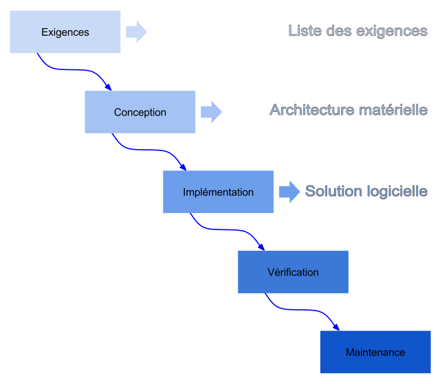
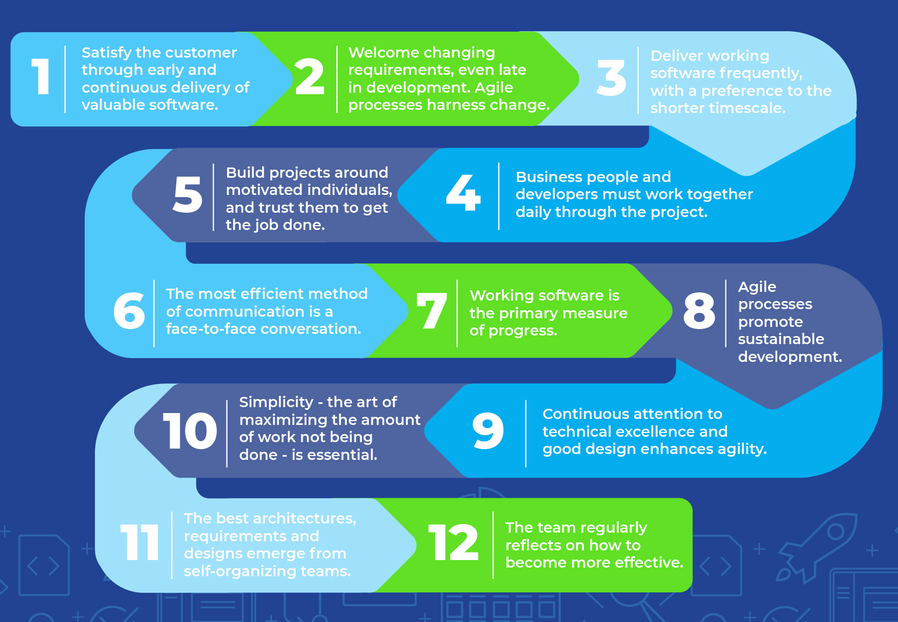
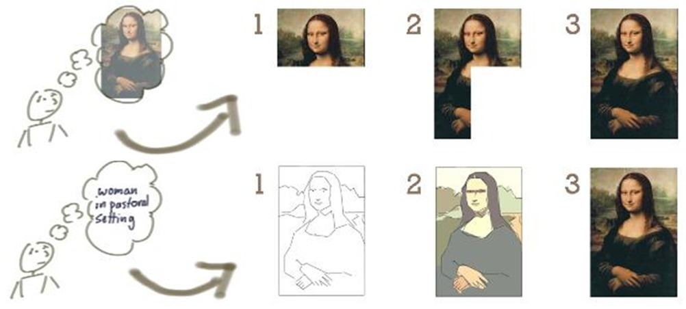
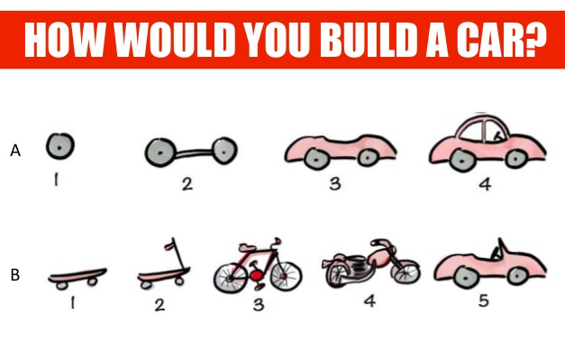
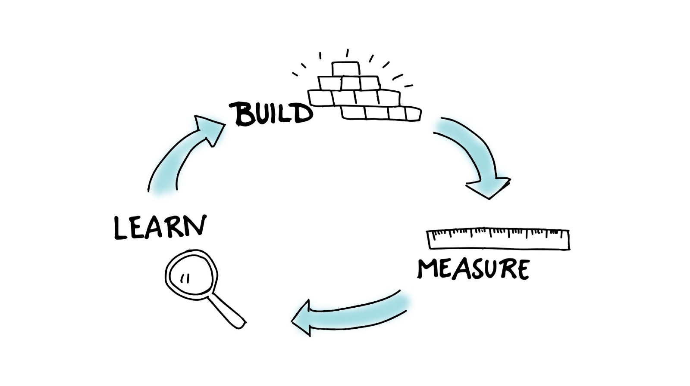
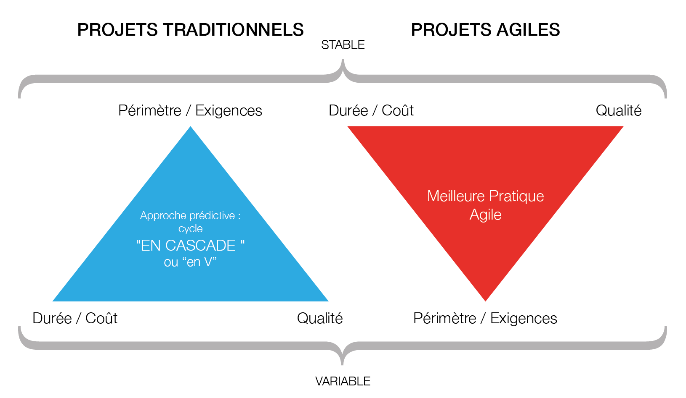
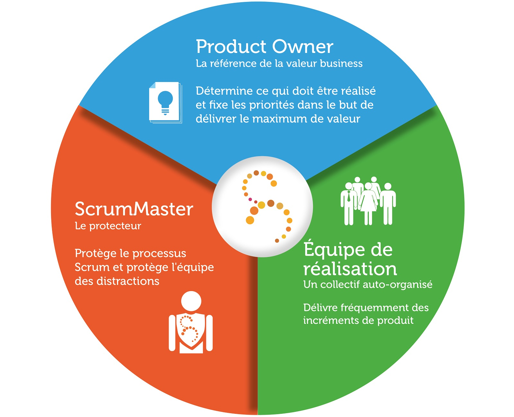

# La méthode agile

Conférence janvier 2019

---

# A Gil ? T'as dit quoi ?

***

## L'ancien temps : le projet en cascade
\#windows95

***

## Le Manifeste Agile
Ecrit en 2001 par 17 informaticiens.

« Nous découvrons comment mieux développer des logiciels par la pratique
 et
en aidant les autres à le faire. Ces expériences nous ont amenés à valoriser :
* Les invidivus et leurs interactions
* Des logiciels opérationnels
* La collboration avec les clients
* L’adaptation
au changement

***

Par rapport à:
* Les processus et les outils
* Une documentation exhaustive
* La négociation contractuelle
* Le suivi d'un plan

Nous reconnaissons la valeur des seconds éléménts, mais privilégions les premiers. »

***

### Les 12 principes

***

### Quelques exemples
Peindre Mona Lisa avec la méthode Agile

***

### Quelques exemples
Construire une voiture avec la méthode Agile

***

## MVP & boucle de feedback

* À chaque iération d'un projet agile, on cronstruit un MVP, produit minimum viable.
* Les itérations correspondent à la boucle du feedback :

***

## Agile vs cascade

---

# SCRUM

SCRUM (mélée en français) est un framework qui implémente la méthode Agile, en se focalisant sur le développement logiciel

***

## L'équipe SCRUM (3-10 personnes)

***

## En un coup d'oeil

***

# Un mot sur les outils de ticketing

* L’outil de suivi de projet JIRA Agile permet d’appliquer concrètement toutes
les étapes du framework Scrum pour suivre les projets en méthode Agile.
* Solution payante (minimum 10€/an en installation locale), il existe d'autres alternatives mais Jira est le plus utilisé de loin.

---

# Un cas pratique
