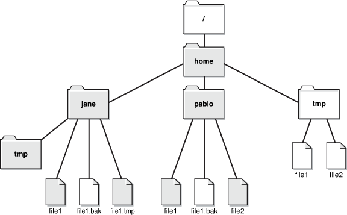

#Welcome !

---

##Votre matériel
* Un PC (sous ubuntu)
* Installé par défaut :
  * Atom (votre éditeur de texte)
  * et plein d'autre trucs que l'on verra en temps voulu !

***

##Ubuntu, c'est quoi ?
* Système d'exploitation libre et "open source"
* Forte ressemblance à Windows
* Sauf que c'est basé sur Linux

***

##Et Linux alors ?
* Basé sur UNIX (un concurent de MS-DOS - Microsoft)
* Sauf que c'est libre !

***

##Atom ?
* C'est un éditeur de texte "libre" (vous allez l'entendre souvent !)
* C'est disponible sur une grande majorité des systèmes d'exploitation actuels (Linux, OSX, Windows)

***

##Et le reste ?
 <!-- .element: class="fragment" -->

Nous avons installé des programmes qui vons nous permettre de mener à bien nos cours.<!-- .element: class="fragment" -->

---

#Bon et sinon on commence quand ?
 <!-- .element: class="fragment" -->

---

#Créez votre utilisateur !
prenom_nomdefamille et mettez un mot de passe qui va bien.

Ouvrez la session de votre nouvel utilisateur !

Note: Recherche compte utilisateurs, Dévérouiller (en haut à droite), Ajouter un compte, Type de compte : administrateur, Activer le compte (compte désactivé), entrer le mot de passe (au moins des chiffres et des lettres). Et VOILÀ

---

#Les fichiers et dossiers
Votre système d'exploitation organise les fichiers et dossiers dans une arborescence.

Mais ça veut dire quoi, et puis ça nous sert à quoi ?

***

##Les fichiers ?

Les fichiers servent à stocker des données (image, texte, vidéo, page de site internet, données pour un projet, etc.)

Les extensions, définies par ce qu'il y a après le `.` dans le nom d'un fichier, permettent une interprétation spécifique de ces derniers.

Exemples :
* `toto.txt ` : est un fichier `texte` (pour les bloc-notes etc.)
* `toto.html` : est un fichier `html` (une page web quoi)

***

##Les dossiers ?

Ce sont des conteneurs, ils nous permettent de ranger nos fichiers pour organiser le tout !

Par exemple, vous avez un dossier pour l'utilisateur que vous venez de créer. Il se trouve ici : `/home/prenom_nomdefamille/`

***

#C'était quoi ça ?
C'est ce que l'on appelle un chemin d'accès. Les dossiers sont séparés par des `/` (ou `\` selon les spécifications de l'OS).

Il y a deux types de chemins d'accès (ou `path` en anglais). Les chemins relatifs ou absolus.

***

#Chemin d'accès absolu
C'est un chemin d'accès qui est complet. Il part de la racine et spécifie tout les dossiers. Il commence par un `/`. Exemple : Actuellement vous êtes dans : `/home/prenom_nomdefamille`.

***

#Chemin d'accès relatif
C'est un chemin d'accès qui est relatif au dossier courant. Il ne commence pas pas un `/`.
Nous en verrons des exemples plus tard.

***

#Parcourir un chemin d'accès
Quelques techniques peuvent être utiles pour un chemin d'accès :
* `.` correspond au dossier courant
* `..` correspond au dossier parent

***

##Pro tip :
Voyez le tout comme un arbre. Les fichiers étant les feuilles et les noeds des branches comme des dossiers, puis les branches comme des liens :

 <!-- .element: class="fragment" -->

---

#Maintenant à vous !
Pour qu'on puisse s'y retrouver avec tout ce qu'on va faire pendant 6 mois, il faut que vous ayez un espace de travail propre sur votre PC.

Comment est-ce qu'on pourrait faire ça ?

*il n'y a pas de solution magique* `:(`

***

##Pro tip :
Suivez cette organisation que vous vous imposez pendant quelques semaines et ça deviendra un automatisme.

Et puis entre nous, c'est beaucoup plus simple travailler quand tout est bien rangé.

---

#Et voilà !
